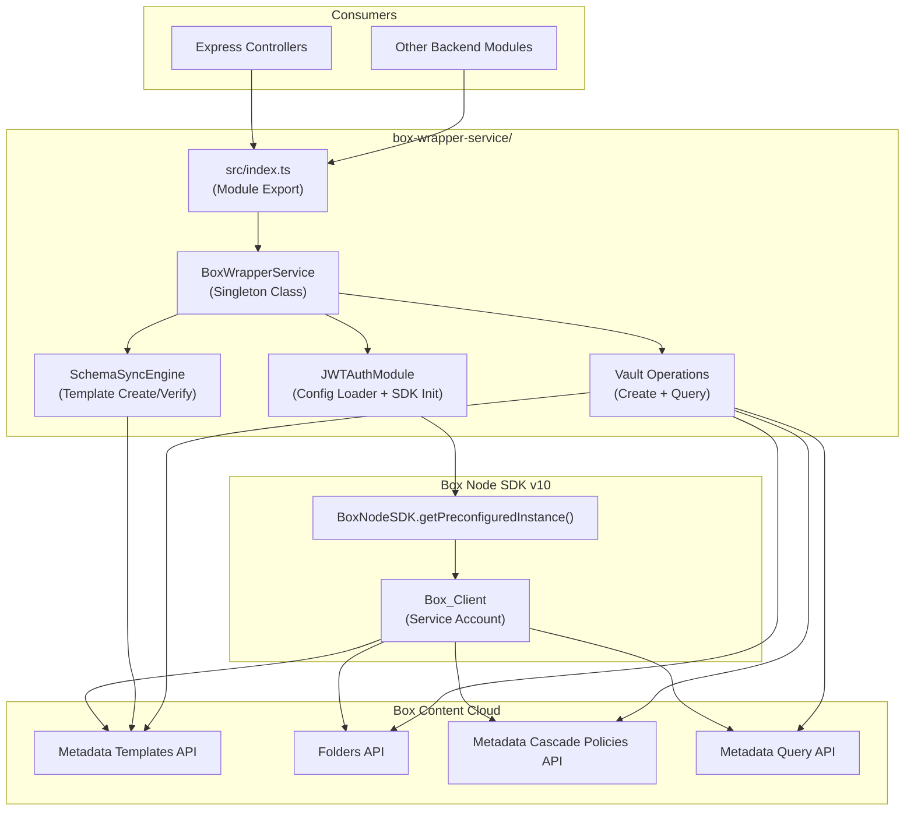

# Design Document: Box Wrapper Service

## Overview

This design covers the Box.com Intelligent Wrapper Service for TaxFlow Pro — a backend TypeScript/Node.js service that uses Box Content Cloud as the sole file system, metadata database, and security layer. The service eliminates the need for an external database by leveraging Box's Metadata Query API for client-to-folder mapping.

The service lives in a new `box-wrapper-service/` directory at the project root, separate from the existing `taxflow-app/` React frontend. It uses the Box Node SDK v10 with JWT Server-to-Server authentication, implements a singleton pattern for the Box client, and manages metadata schema synchronization on startup.

### Key Design Decisions

1. **Singleton Pattern** — A single `BoxWrapperService` class instance is exported. The Box client is initialized once and reused across all callers. This avoids redundant JWT token exchanges and aligns with the SDK's built-in token caching.
2. **No External Database** — Box Content Cloud serves as file system, metadata store, and security layer. Client-to-folder mapping is done via the Metadata Query API against the `taxFlowClientProfile` template.
3. **Schema Sync on Startup** — The `taxFlowClientProfile` metadata template is created or verified before the service accepts vault operations. A 409 conflict response is treated as success (template already exists).
4. **Box Node SDK v10** — Uses `BoxNodeSDK.getPreconfiguredInstance()` for JWT auth. The SDK handles token refresh and automatic retries for transient errors out of the box.
5. **Metadata Cascade Policies** — Each vault folder gets a cascade policy that propagates `taxFlowClientProfile` metadata to all child items automatically, ensuring every uploaded document is traceable without manual tagging.
6. **Separate Service Directory** — The backend service is a standalone Node.js/TypeScript project (`box-wrapper-service/`) with its own `package.json`, `tsconfig.json`, and test configuration. It does not share dependencies with the React frontend.

## Architecture



### Startup Sequence

```mermaid
sequenceDiagram
    participant App as Express App
    participant BWS as BoxWrapperService
    participant JWT as JWTAuthModule
    participant SS as SchemaSyncEngine
    participant Box as Box Content Cloud

    App->>BWS: import & initialize
    BWS->>JWT: loadConfig(box_config.json)
    JWT->>JWT: Validate config structure
    JWT->>Box: getPreconfiguredInstance(config)
    Box-->>JWT: SDK instance
    JWT->>Box: getServiceAccountClient()
    Box-->>JWT: Authenticated Box_Client
    JWT-->>BWS: Box_Client (cached)
    BWS->>SS: syncMetadataSchema()
    SS->>Box: GET /metadata_templates/enterprise/taxFlowClientProfile
    alt Template exists
        Box-->>SS: 200 OK (template)
        SS-->>BWS: Schema in sync
    else Template missing
        Box-->>SS: 404 Not Found
        SS->>Box: POST /metadata_templates/schema
        alt Created
            Box-->>SS: 201 Created
            SS-->>BWS: Schema created
        else 409 Conflict (race condition)
            Box-->>SS: 409 Conflict
            SS-->>BWS: Schema already exists (OK)
        end
    end
    BWS-->>App: Service ready
```

### Vault Creation Flow

```mermaid
sequenceDiagram
    participant Ctrl as Express Controller
    participant BWS as BoxWrapperService
    participant Box as Box Content Cloud

    Ctrl->>BWS: createAutomatedVault(clientName, externalId, email)
    BWS->>Box: POST /folders (name: "clientName (externalId)", parent: ROOT_FOLDER_ID)
    Box-->>BWS: Folder object (with id)
    BWS->>Box: POST /folders/{id}/metadata/enterprise/taxFlowClientProfile
    Box-->>BWS: Metadata applied
    BWS->>Box: POST /metadata_cascade_policies (folder_id, scope, templateKey)
    Box-->>BWS: Cascade policy created
    BWS-->>Ctrl: { folder object with id }
    
    Note over Box: Future uploads to this folder<br/>auto-inherit metadata via cascade
```

## Components and Interfaces

### BoxWrapperService (Singleton)

```typescript
// src/services/BoxWrapperService.ts

interface VaultFolder {
  id: string;
  name: string;
  type: 'folder';
}

interface CreateVaultResult {
  folder: VaultFolder;
  metadataCascadePolicyId: string;
}

class BoxWrapperService {
  private boxClient: BoxClient | null = null;
  private schemaReady: boolean = false;

  /**
   * Returns the singleton authenticated Box client.
   * Uses SDK built-in token caching.
   * @throws Error if JWT config is missing or malformed
   */
  getBoxClient(): BoxClient;

  /**
   * Ensures the taxFlowClientProfile metadata template exists.
   * Must complete before any vault operations.
   * Treats 409 Conflict as success.
   * @throws Error on unexpected API errors
   */
  async syncMetadataSchema(): Promise<void>;

  /**
   * Creates a vault folder with metadata and cascade policy.
   * @param clientName - Display name for the client
   * @param externalId - Unique external identifier (from auth provider)
   * @param email - Client email address
   * @returns Created folder object with Box folder ID
   * @throws Error if folder creation fails
   * @throws Error if cascade policy fails (includes folder ID for remediation)
   */
  async createAutomatedVault(
    clientName: string,
    externalId: string,
    email: string
  ): Promise<CreateVaultResult>;

  /**
   * Finds a vault folder by external ID using Metadata Query API.
   * @param externalId - The client_external_id to search for
   * @returns The matching folder or null if not found
   * @throws Error on API/network failures
   */
  async findVaultByExternalId(externalId: string): Promise<VaultFolder | null>;
}
```

### JWTAuthModule (Internal)

```typescript
// src/auth/JWTAuthModule.ts

interface BoxJWTConfig {
  boxAppSettings: {
    clientID: string;
    clientSecret: string;
    appAuth: {
      publicKeyID: string;
      privateKey: string;
      passphrase: string;
    };
  };
  enterpriseID: string;
}

class JWTAuthModule {
  private sdk: BoxNodeSDK | null = null;
  private client: BoxClient | null = null;

  /**
   * Loads and validates box_config.json, initializes SDK.
   * @param configPath - Path to box_config.json
   * @throws Error if file missing, unreadable, or malformed
   */
  initialize(configPath: string): void;

  /**
   * Returns the authenticated service account client.
   * Caches the client instance (singleton).
   */
  getClient(): BoxClient;
}
```

### SchemaSyncEngine (Internal)

```typescript
// src/schema/SchemaSyncEngine.ts

interface TemplateField {
  type: 'string' | 'enum';
  key: string;
  displayName: string;
  options?: Array<{ key: string }>;  // For enum/dropdown fields
}

class SchemaSyncEngine {
  constructor(private client: BoxClient) {}

  /**
   * Creates or verifies the taxFlowClientProfile template.
   * @throws Error on unexpected failures (non-409 errors)
   */
  async sync(): Promise<void>;

  /**
   * Returns the template field definitions for taxFlowClientProfile.
   */
  getTemplateFields(): TemplateField[];
}
```

### Module Export

```typescript
// src/index.ts
import { BoxWrapperService } from './services/BoxWrapperService';

const boxWrapperService = new BoxWrapperService();
export default boxWrapperService;
export { BoxWrapperService };
export type { VaultFolder, CreateVaultResult };
```

## Data Models

### Metadata Template: taxFlowClientProfile

| Field Key | Display Name | Type | Notes |
|-----------|-------------|------|-------|
| `client_external_id` | Client External ID | String | Indexed. Maps to auth provider user ID. |
| `client_email` | Client Email | String | Indexed. Client's email address. |
| `tax_year_current` | Current Tax Year | String | e.g., "2024" |
| `vault_status` | Vault Status | Enum (Dropdown) | Options: `Active`, `Pending`, `Archived` |
| `firm_id` | Firm ID | String | Associates vault with a firm. |

### Template Definition (SDK Format)

```typescript
const TEMPLATE_DEFINITION = {
  scope: 'enterprise',
  displayName: 'TaxFlow Client Profile',
  templateKey: 'taxFlowClientProfile',
  fields: [
    { type: 'string', key: 'client_external_id', displayName: 'Client External ID' },
    { type: 'string', key: 'client_email', displayName: 'Client Email' },
    { type: 'string', key: 'tax_year_current', displayName: 'Current Tax Year' },
    {
      type: 'enum',
      key: 'vault_status',
      displayName: 'Vault Status',
      options: [
        { key: 'Active' },
        { key: 'Pending' },
        { key: 'Archived' },
      ],
    },
    { type: 'string', key: 'firm_id', displayName: 'Firm ID' },
  ],
};
```

### Vault Folder Naming Convention

```
Format: "{clientName} ({externalId})"
Example: "Acme Industries LLC (auth0|abc123)"
```

### Metadata Query Format

```typescript
// Used by findVaultByExternalId
const query = {
  from: 'enterprise_<ENTERPRISE_ID>.taxFlowClientProfile',
  query: 'client_external_id = :id',
  query_params: { id: externalId },
  ancestor_folder_id: ROOT_FOLDER_ID,
  fields: ['id', 'name', 'type'],
};
```

### Configuration File: box_config.json

```json
{
  "boxAppSettings": {
    "clientID": "[BOX_CLIENT_ID]",
    "clientSecret": "[BOX_CLIENT_SECRET]",
    "appAuth": {
      "publicKeyID": "[PUBLIC_KEY_ID]",
      "privateKey": "[PRIVATE_KEY_CONTENTS]",
      "passphrase": "[PASSPHRASE]"
    }
  },
  "enterpriseID": "[ENTERPRISE_ID]"
}
```

### Environment Configuration

```typescript
interface ServiceConfig {
  configPath: string;       // Path to box_config.json (default: './box_config.json')
  rootFolderId: string;     // Box folder ID where vaults are created (default: '0' for root)
}
```


## Correctness Properties

*A property is a characteristic or behavior that should hold true across all valid executions of a system — essentially, a formal statement about what the system should do. Properties serve as the bridge between human-readable specifications and machine-verifiable correctness guarantees.*

### Property 1: Singleton client identity

*For any* number of calls N (N ≥ 2) to `getBoxClient()`, all returned values should be referentially identical (the same object instance).

**Validates: Requirements 1.4**

### Property 2: Malformed configuration produces descriptive errors

*For any* JWT configuration object that is missing required fields (`boxAppSettings`, `clientID`, `clientSecret`, `appAuth`, `enterpriseID`) or contains non-string values for those fields, calling `initialize()` should throw an error whose message describes the specific configuration problem.

**Validates: Requirements 1.6**

### Property 3: Non-409 schema sync errors propagate

*For any* HTTP error status code other than 409 returned during metadata template creation, `syncMetadataSchema()` should throw an error. Conversely, a 409 status code should not cause an error.

**Validates: Requirements 2.3, 2.4**

### Property 4: Vault operations require schema readiness

*For any* call to `createAutomatedVault()` or `findVaultByExternalId()` made before `syncMetadataSchema()` has completed successfully, the service should throw an error indicating the schema is not ready.

**Validates: Requirements 2.5**

### Property 5: Vault folder naming format

*For any* non-empty `clientName` and `externalId` strings, `createAutomatedVault(clientName, externalId, email)` should create a folder whose name equals `"{clientName} ({externalId})"` and return a result containing the folder's Box ID.

**Validates: Requirements 3.1, 3.5**

### Property 6: Vault metadata contains provided values

*For any* `externalId` and `email` strings passed to `createAutomatedVault()`, the metadata applied to the created folder should contain `client_external_id` equal to `externalId` and `client_email` equal to `email`.

**Validates: Requirements 3.2**

### Property 7: Metadata query construction and result mapping

*For any* `externalId` string, `findVaultByExternalId(externalId)` should query the `enterprise` scope `taxFlowClientProfile` template with `client_external_id` equal to the provided `externalId`, and when the query returns entries, the result should be a `VaultFolder` object with the matching folder's `id` and `name`.

**Validates: Requirements 4.1, 4.2, 4.5**

## Error Handling

### JWT Authentication Errors

| Scenario | Handling | User Impact |
|----------|----------|-------------|
| `box_config.json` missing | `JWTAuthModule.initialize()` throws `Error('JWT configuration file not found at {path}')` | Service fails to start |
| `box_config.json` malformed JSON | Throws `Error('JWT configuration file contains invalid JSON')` | Service fails to start |
| Config missing required fields | Throws `Error('JWT configuration missing required field: {fieldName}')` | Service fails to start |
| SDK initialization failure | Propagates SDK error with context: `Error('Failed to initialize Box SDK: {sdkError}')` | Service fails to start |

### Schema Sync Errors

| Scenario | Handling | User Impact |
|----------|----------|-------------|
| Template already exists (409) | Treated as success, log info message, continue startup | None — normal operation |
| Template check/create fails (non-409) | Throws `Error('Schema sync failed: {apiError}')`, prevents service startup | Service fails to start |
| Network timeout during sync | SDK retry handles transient failures; persistent failure throws | Service fails to start after retries |

### Vault Creation Errors

| Scenario | Handling | User Impact |
|----------|----------|-------------|
| Schema not synced yet | Throws `Error('Service not ready: metadata schema has not been synchronized')` | Caller must wait for startup |
| Folder creation API failure | Throws `Error('Failed to create vault folder: {apiError}')` | Caller receives error, no folder created |
| Metadata application failure | Throws `Error('Failed to apply metadata to folder {folderId}: {apiError}')` with folder ID | Caller can retry or manually remediate |
| Cascade policy creation failure | Throws `Error('Vault folder {folderId} created but cascade policy failed: {apiError}. Manual remediation required.')` | Folder exists but cascade not active; error includes folder ID |

### Vault Query Errors

| Scenario | Handling | User Impact |
|----------|----------|-------------|
| Schema not synced yet | Throws `Error('Service not ready: metadata schema has not been synchronized')` | Caller must wait for startup |
| No matching vault found | Returns `null` | Caller handles null (e.g., create new vault) |
| Metadata Query API failure | Throws `Error('Vault query failed for externalId {id}: {apiError}')` | Caller receives error |

### Error Design Principles

1. **Fail fast on startup** — Config and schema errors prevent the service from accepting requests. This avoids partial operation states.
2. **Include context in errors** — Every error message includes the operation that failed and relevant identifiers (folder ID, external ID, field name).
3. **Partial failure transparency** — When vault creation partially succeeds (folder created but cascade fails), the error includes the folder ID so the caller can remediate.
4. **Delegate retries to SDK** — The Box Node SDK v10 handles transient error retries automatically. The wrapper does not implement its own retry logic.

## Testing Strategy

### Testing Framework

- **Unit Tests:** Vitest (consistent with the existing `taxflow-app/` project)
- **Property-Based Tests:** [fast-check](https://github.com/dubzzz/fast-check) (already used in the project)
- **Mocking:** Vitest's built-in `vi.mock()` and `vi.fn()` for Box SDK mocking
- **Minimum iterations:** 100 per property test

### Project Test Configuration

```
box-wrapper-service/
├── src/
│   ├── services/BoxWrapperService.ts
│   ├── auth/JWTAuthModule.ts
│   ├── schema/SchemaSyncEngine.ts
│   └── index.ts
├── tests/
│   ├── unit/
│   │   ├── JWTAuthModule.test.ts
│   │   ├── SchemaSyncEngine.test.ts
│   │   ├── BoxWrapperService.test.ts
│   │   └── vaultNaming.test.ts
│   └── property/
│       ├── singleton.property.test.ts
│       ├── configValidation.property.test.ts
│       ├── schemaSync.property.test.ts
│       ├── schemaReadiness.property.test.ts
│       ├── vaultNaming.property.test.ts
│       ├── vaultMetadata.property.test.ts
│       └── metadataQuery.property.test.ts
├── package.json
├── tsconfig.json
└── vitest.config.ts
```

### Unit Tests (Examples & Edge Cases)

Unit tests cover specific examples, integration points, and edge cases:

- JWTAuthModule loads a valid `box_config.json` and returns a client (Req 1.1, 1.2)
- JWTAuthModule throws when config file is missing (Req 1.6 — edge case)
- JWTAuthModule throws when config JSON is malformed (Req 1.6 — edge case)
- `getBoxClient()` method exists and returns a BoxClient (Req 1.3)
- `syncMetadataSchema()` calls the metadata templates API (Req 2.1)
- `syncMetadataSchema()` creates template with exactly 5 fields when missing (Req 2.2)
- `syncMetadataSchema()` succeeds silently on 409 conflict (Req 2.3 — edge case)
- `createAutomatedVault()` calls folders API, metadata API, and cascade policy API in order (Req 3.3)
- `createAutomatedVault()` error includes folder ID when cascade policy fails (Req 3.7 — edge case)
- `findVaultByExternalId()` returns null when no results (Req 4.3 — edge case)
- `findVaultByExternalId()` throws descriptive error on API failure (Req 4.4 — edge case)
- Module exports singleton instance from `src/services/BoxWrapperService.ts` (Req 5.1)
- Exported instance has all four public methods (Req 5.2)

### Property-Based Tests

Each correctness property maps to a single property-based test using fast-check:

1. **Feature: box-wrapper-service, Property 1: Singleton client identity** — Generate random call counts (2–50), call `getBoxClient()` that many times, verify all results are `===` to the first.

2. **Feature: box-wrapper-service, Property 2: Malformed configuration produces descriptive errors** — Generate random objects missing required fields or with wrong types, verify `initialize()` throws with a message mentioning the problematic field.

3. **Feature: box-wrapper-service, Property 3: Non-409 schema sync errors propagate** — Generate random HTTP status codes (400–599 excluding 409), mock the API to return that status, verify `syncMetadataSchema()` throws. Also verify 409 does not throw.

4. **Feature: box-wrapper-service, Property 4: Vault operations require schema readiness** — Generate random vault operation calls (createAutomatedVault with random args, findVaultByExternalId with random ID) before sync, verify all throw.

5. **Feature: box-wrapper-service, Property 5: Vault folder naming format** — Generate random non-empty strings for clientName and externalId, verify the folder creation call uses name `"{clientName} ({externalId})"` and the result contains a folder ID.

6. **Feature: box-wrapper-service, Property 6: Vault metadata contains provided values** — Generate random externalId and email strings, verify the metadata API call payload contains `client_external_id === externalId` and `client_email === email`.

7. **Feature: box-wrapper-service, Property 7: Metadata query construction and result mapping** — Generate random externalId strings and mock API responses with random folder data, verify the query uses enterprise scope with correct parameters and the result maps to a VaultFolder with matching id and name.

### Test Configuration

```typescript
// fast-check configuration for all property tests
import fc from 'fast-check';

fc.assert(
  fc.property(/* arbitraries */, (/* values */) => {
    // property assertion
  }),
  { numRuns: 100 }
);
```

Each property test file includes a comment referencing the design property:
```typescript
// Feature: box-wrapper-service, Property N: <property title>
```

### Mocking Strategy

All tests mock the Box Node SDK to avoid real API calls:

```typescript
// Example mock setup
vi.mock('box-node-sdk', () => ({
  getPreconfiguredInstance: vi.fn(() => ({
    getServiceAccountClient: vi.fn(() => mockBoxClient),
  })),
}));

const mockBoxClient = {
  metadata: {
    templates: { create: vi.fn(), get: vi.fn() },
  },
  folders: {
    create: vi.fn(),
    addMetadata: vi.fn(),
  },
  metadata_cascade_policies: {
    create: vi.fn(),
  },
  search: {
    query: vi.fn(),
  },
};
```
