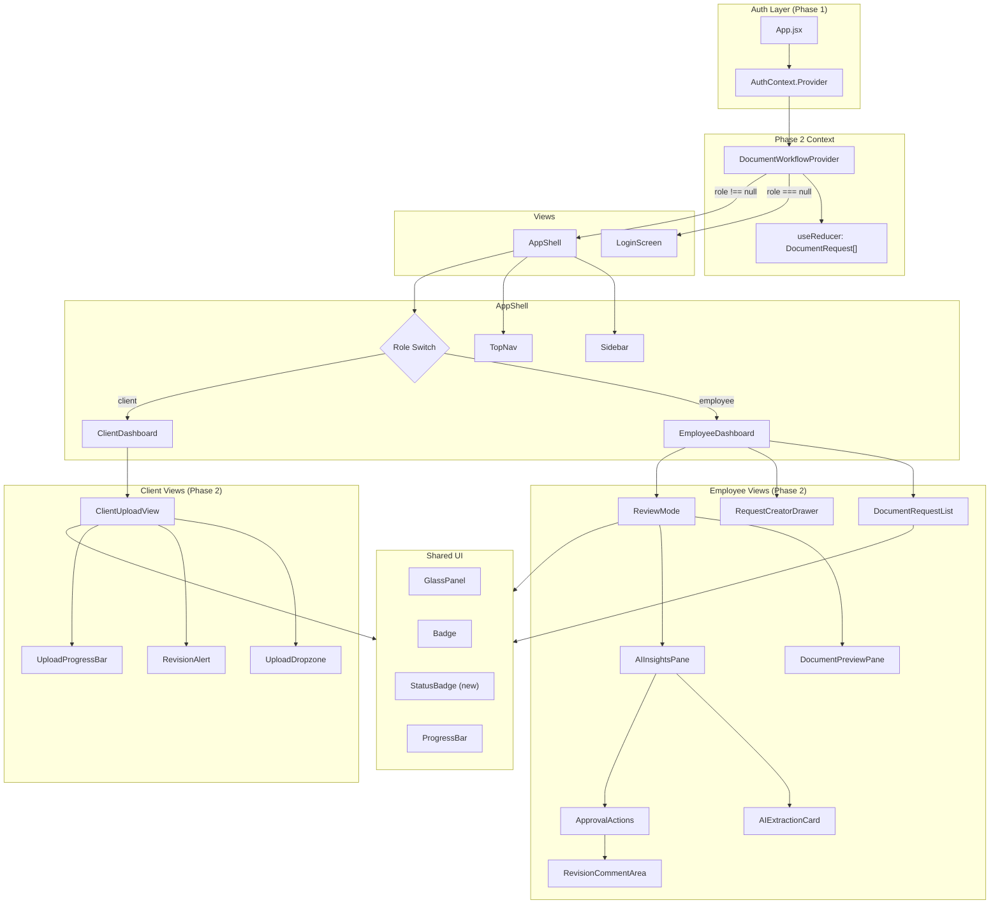
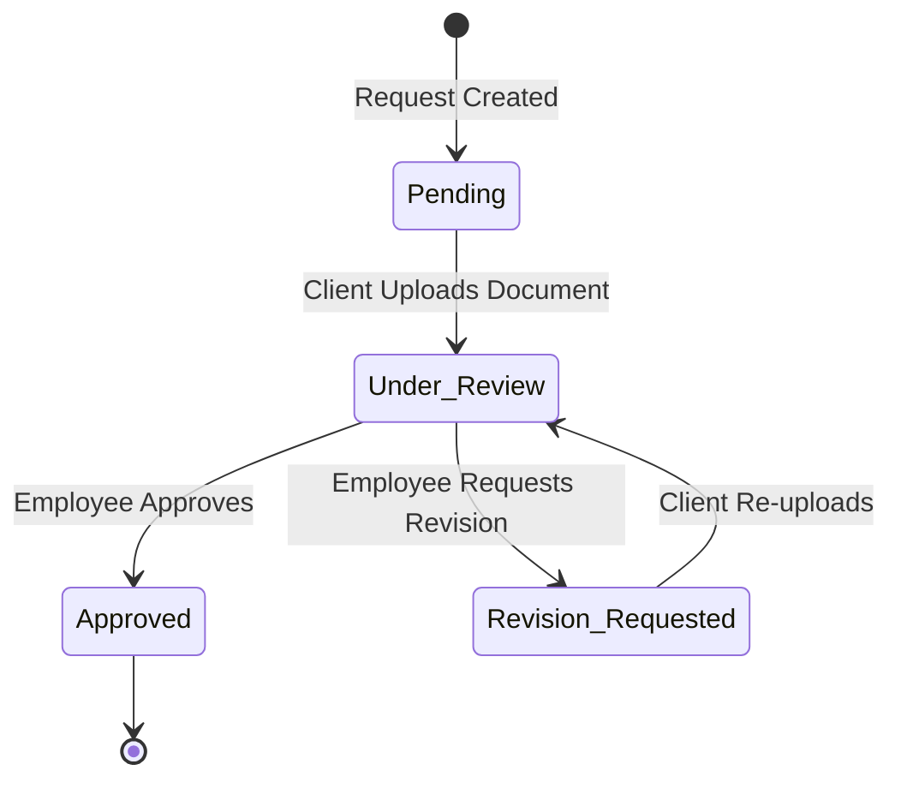

# Design Document: TaxFlow Pro Phase 2 — Core Document Workflow & Box AI Review Engine

## Overview

This design covers the Core Document Workflow and Box AI Review Engine for TaxFlow Pro Phase 2. Building on the authenticated dashboard structure from Phase 1, this phase introduces the functional UI for document request creation (employee), client upload experience, and AI-powered employee review. All new components continue the glassmorphism aesthetic, Framer Motion animations, and dark-mode design language established in Phase 1.

### Key Design Decisions

1. **`useReducer` for Workflow State Machine** — Document status transitions follow a strict state machine (Pending → Under_Review → Approved/Revision_Requested). A reducer enforces valid transitions and rejects invalid ones, making the logic testable in isolation.
2. **DocumentWorkflowContext** — A new React context wraps the document request state (array of `DocumentRequest` objects) and the dispatch function. This keeps state centralized and accessible from both Employee and Client dashboards without prop drilling.
3. **No React Router (continued)** — Phase 2 continues the conditional rendering pattern from Phase 1. View switching within dashboards uses local state (e.g., `selectedRequest`, `viewMode`) rather than URL routes.
4. **Mock data only (continued)** — All Box AI extraction results, confidence scores, and prior-year clone data are hardcoded mock data. No API layer.
5. **Shared UI reuse** — New components reuse `GlassPanel`, `Badge`, `ProgressBar`, `SectionHeader`, `PanelTitle`, and `StatusDot` from `ui.jsx`. New shared components (`StatusBadge`, `UploadDropzone`) are added to `ui.jsx` or co-located with their feature.
6. **Framer Motion for all Phase 2 animations** — Drawer slide, dropzone glow, progress bar, staggered list entry, split-pane reveal, and revision comment expand all use Framer Motion's `motion` components and `AnimatePresence`.

## Architecture



### Component Tree

```
<App>
  <AuthContext.Provider>
    <DocumentWorkflowProvider>
      <AnimatePresence mode="wait">
        {!user ? <LoginScreen /> : <AppShell />}
      </AnimatePresence>
    </DocumentWorkflowProvider>
  </AuthContext.Provider>
</App>

<!-- Employee Dashboard expanded -->
<EmployeeDashboard>
  {viewMode === 'list' && (
    <>
      <StatCards />
      <DocumentRequestList
        requests={requests}
        onSelectRequest={setSelectedRequest}
      />
      <RequestCreatorDrawer
        isOpen={drawerOpen}
        onClose={closeDrawer}
        onSubmit={dispatch}
      />
    </>
  )}
  {viewMode === 'review' && (
    <ReviewMode request={selectedRequest}>
      <DocumentPreviewPane />
      <AIInsightsPane>
        <AIExtractionCard fields={mockExtractionData} />
        <ApprovalActions
          onApprove={handleApprove}
          onRequestRevision={handleRevision}
        />
      </AIInsightsPane>
    </ReviewMode>
  )}
</EmployeeDashboard>

<!-- Client Dashboard expanded -->
<ClientDashboard>
  {!selectedRequest && <RequestListForClient requests={clientRequests} />}
  {selectedRequest && (
    <ClientUploadView request={selectedRequest}>
      {status === 'Revision_Requested' && <RevisionAlert comments={request.revisionComments} />}
      {status === 'Pending' || status === 'Revision_Requested' && <UploadDropzone onUpload={handleUpload} />}
      {status === 'Under_Review' && <UnderReviewMessage />}
      {status === 'Approved' && <ApprovedConfirmation />}
    </ClientUploadView>
  )}
</ClientDashboard>
```

## Components and Interfaces

### 1. DocumentWorkflowProvider / useDocumentWorkflow

Central context providing document request state and dispatch.

```jsx
// context/DocumentWorkflowContext.jsx
const DocumentWorkflowContext = createContext(null)

function documentReducer(state, action) {
  switch (action.type) {
    case 'ADD_REQUEST':       // → new request with status Pending
    case 'CLONE_PRIOR_YEAR':  // → bulk add from mock 2024 data
    case 'UPLOAD_DOCUMENT':   // → Pending|Revision_Requested → Under_Review
    case 'APPROVE':           // → Under_Review → Approved
    case 'REQUEST_REVISION':  // → Under_Review → Revision_Requested (+ comments)
    default: return state
  }
}

export function DocumentWorkflowProvider({ children }) {
  const [requests, dispatch] = useReducer(documentReducer, INITIAL_MOCK_REQUESTS)
  return (
    <DocumentWorkflowContext.Provider value={{ requests, dispatch }}>
      {children}
    </DocumentWorkflowContext.Provider>
  )
}

export function useDocumentWorkflow() {
  return useContext(DocumentWorkflowContext)
}
```

### 2. RequestCreatorDrawer

Slide-out drawer from the right for creating new document requests.

**Props:** `isOpen: boolean`, `onClose: () => void`

**Behavior:**
- Framer Motion `animate` with `x` translation (off-screen right → 0) and opacity
- Backdrop overlay with click-to-close
- Form fields: Document Name (required), Description (required), Due Date (required), Priority select (Low/Medium/High/Urgent, default Medium)
- Inline validation: red border + message on empty required fields on submit attempt
- "Clone 2024 Requests" button with animated gradient border (CSS `background-size` animation or Framer Motion)
- On valid submit: dispatches `ADD_REQUEST`, closes drawer
- On clone: dispatches `CLONE_PRIOR_YEAR`, closes drawer

### 3. DocumentRequestList

Vertical list of document requests with status badges.

**Props:** `requests: DocumentRequest[]`, `onSelect: (id) => void`

**Behavior:**
- Each row shows: document name, due date, priority badge, status badge
- Staggered fade-in-up on mount (Framer Motion `variants` with `staggerChildren: 0.06`)
- Hover micro-interaction: subtle background highlight + `translateX(2px)`
- Clicking a row with status `Under_Review` navigates to ReviewMode
- `StatusBadge` component maps status to color: Pending→gray, Under_Review→yellow, Revision_Requested→red, Approved→green
- Status badge color transitions use Framer Motion `animate` on `backgroundColor`

### 4. ClientUploadView

Detail view for a single document request from the client perspective.

**Props:** `request: DocumentRequest`, `onBack: () => void`

**Behavior:**
- Displays document name, description, due date, priority, current status
- Conditionally renders based on status:
  - `Pending`: UploadDropzone active
  - `Revision_Requested`: RevisionAlert + UploadDropzone active
  - `Under_Review`: disabled state with "Being reviewed" message
  - `Approved`: green checkmark animation (Framer Motion scale + opacity)

### 5. UploadDropzone

Drag-and-drop upload area with immersive visual feedback.

**Props:** `onUpload: (file) => void`, `disabled: boolean`

**Behavior:**
- Large dashed-border rectangle with upload icon and instructional text
- `onDragOver`: border glows cyan (#06b6d4), background darkens with blur
- `onDragLeave`: reverts to default within 200ms
- `onDrop`: triggers simulated upload progress bar (1500–3000ms random duration)
- Progress bar uses Framer Motion `animate` on width with `ease: 'easeOut'`
- On 100%: brief success checkmark animation, then dispatches `UPLOAD_DOCUMENT`

### 6. RevisionAlert

Red-tinted glassmorphism alert showing rejection comments.

**Props:** `comments: string`

**Behavior:**
- Red-tinted translucent background (`rgba(239,68,68,0.08)`), red border accent
- Backdrop-filter blur consistent with GlassPanel
- Framer Motion fade-in + slide-down on mount
- Displays employee rejection comments as readable text

### 7. ReviewMode

Split-pane layout for employee document review.

**Props:** `request: DocumentRequest`, `onBack: () => void`

**Behavior:**
- Left pane: DocumentPreviewPane (placeholder skeleton/mock PDF graphic)
- Right pane: AIInsightsPane (extraction card + action buttons)
- Staggered entry: left pane appears 150ms before right pane
- Below 1024px viewport: stacks vertically (CSS grid with `@media` or Tailwind `lg:` breakpoint)

### 8. AIExtractionCard

Displays mock Box AI extracted data with confidence scores.

**Props:** `fields: ExtractionField[]`

**Behavior:**
- Header with Box AI branding (Bot icon + "Extracted by Box AI" label)
- Each field row: label, extracted value, confidence mini progress bar with percentage
- Purple/cyan accent styling to distinguish AI content
- Staggered fade-in on mount

### 9. ApprovalActions

Approve and Request Revision buttons with RevisionCommentArea.

**Props:** `onApprove: () => void`, `onRequestRevision: (comments: string) => void`

**Behavior:**
- "Approve" button: green scheme, on click dispatches `APPROVE`, shows success animation
- "Request Revision" button: red scheme, on click expands RevisionCommentArea
- RevisionCommentArea: Framer Motion height+opacity expand (200–400ms), textarea + submit button
- Validation: empty comment submission shows inline error message


## Data Models

### DocumentRequest

```typescript
interface DocumentRequest {
  id: string                    // Unique identifier (crypto.randomUUID or counter)
  name: string                  // Document name, e.g. "W-2 Form"
  description: string           // What the client needs to provide
  dueDate: string               // ISO date string, e.g. "2025-03-15"
  priority: 'Low' | 'Medium' | 'High' | 'Urgent'
  status: DocumentStatus
  revisionComments: string | null  // Employee feedback when status is Revision_Requested
  uploadedFileName: string | null  // Name of uploaded file (mock)
  clientId: string              // Associated client identifier
}

type DocumentStatus = 'Pending' | 'Under_Review' | 'Revision_Requested' | 'Approved'
```

### State Machine Transitions

```typescript
const VALID_TRANSITIONS: Record<DocumentStatus, DocumentStatus[]> = {
  Pending:             ['Under_Review'],
  Under_Review:        ['Approved', 'Revision_Requested'],
  Revision_Requested:  ['Under_Review'],
  Approved:            [],  // terminal state
}

function isValidTransition(from: DocumentStatus, to: DocumentStatus): boolean {
  return VALID_TRANSITIONS[from].includes(to)
}
```



### Reducer Actions

```typescript
type WorkflowAction =
  | { type: 'ADD_REQUEST'; payload: Omit<DocumentRequest, 'id' | 'status' | 'revisionComments' | 'uploadedFileName'> }
  | { type: 'CLONE_PRIOR_YEAR'; payload: { clientId: string } }
  | { type: 'UPLOAD_DOCUMENT'; payload: { requestId: string; fileName: string } }
  | { type: 'APPROVE'; payload: { requestId: string } }
  | { type: 'REQUEST_REVISION'; payload: { requestId: string; comments: string } }
```

### Mock Data

```javascript
// Prior year (2024) templates for clone feature
const PRIOR_YEAR_REQUESTS = [
  { name: 'W-2 Form', description: 'Wage and tax statement from employer', dueDate: '2025-03-15', priority: 'High' },
  { name: '1099-DIV', description: 'Dividend income statement', dueDate: '2025-03-15', priority: 'Medium' },
  { name: '1099-INT', description: 'Interest income statement', dueDate: '2025-03-15', priority: 'Medium' },
  { name: 'Mortgage Interest (1098)', description: 'Mortgage interest deduction form', dueDate: '2025-04-01', priority: 'Low' },
  { name: 'Charitable Donations', description: 'Receipts for charitable contributions', dueDate: '2025-04-01', priority: 'Low' },
]

// Mock AI extraction data for ReviewMode
const MOCK_EXTRACTION_FIELDS = [
  { label: 'W-2 Wages', value: '$85,000', confidence: 98 },
  { label: 'Employer', value: 'Acme Corp', confidence: 95 },
  { label: 'EIN', value: '12-3456789', confidence: 92 },
  { label: 'Federal Tax Withheld', value: '$12,750', confidence: 97 },
]

// Initial requests for demo
const INITIAL_MOCK_REQUESTS = [
  { id: '1', name: 'W-2 Form', description: 'Wage and tax statement', dueDate: '2025-03-15', priority: 'High', status: 'Under_Review', revisionComments: null, uploadedFileName: 'w2-2024.pdf', clientId: 'client-1' },
  { id: '2', name: '1099-DIV', description: 'Dividend income', dueDate: '2025-03-15', priority: 'Medium', status: 'Pending', revisionComments: null, uploadedFileName: null, clientId: 'client-1' },
  { id: '3', name: 'Mortgage Interest', description: '1098 form', dueDate: '2025-04-01', priority: 'Low', status: 'Revision_Requested', revisionComments: 'The uploaded document is for 2023, not 2024. Please upload the correct year.', uploadedFileName: null, clientId: 'client-1' },
]
```

### ExtractionField

```typescript
interface ExtractionField {
  label: string       // e.g. "W-2 Wages"
  value: string       // e.g. "$85,000"
  confidence: number  // 0–100
}
```

### StatusBadge Color Map

```typescript
const STATUS_COLORS: Record<DocumentStatus, string> = {
  Pending:             '#6b7280', // gray
  Under_Review:        '#eab308', // yellow
  Revision_Requested:  '#ef4444', // red
  Approved:            '#22c55e', // green
}
```


## Correctness Properties

*A property is a characteristic or behavior that should hold true across all valid executions of a system — essentially, a formal statement about what the system should do. Properties serve as the bridge between human-readable specifications and machine-verifiable correctness guarantees.*

### Property 1: State machine enforces valid transitions only

*For any* `DocumentStatus` value and *any* attempted target status, the reducer should accept the transition if and only if it is in the valid transition map (`Pending→Under_Review`, `Under_Review→Approved`, `Under_Review→Revision_Requested`, `Revision_Requested→Under_Review`). For any transition not in this set, the document status should remain unchanged.

**Validates: Requirements 10.1, 10.3, 5.5, 6.5, 9.2, 9.6**

### Property 2: Newly created requests always have Pending status

*For any* valid form input (non-empty name, description, due date, and any priority value), creating a new `DocumentRequest` via the reducer should produce a request with `status === 'Pending'`, `revisionComments === null`, and `uploadedFileName === null`.

**Validates: Requirements 1.4, 2.2**

### Property 3: Form validation rejects submissions with empty required fields

*For any* combination of form field values where at least one required field (name, description, or due date) is empty or whitespace-only, the `RequestCreatorDrawer` should reject the submission and the request list should remain unchanged.

**Validates: Requirements 1.6**

### Property 4: Revision comment validation rejects empty comments

*For any* string composed entirely of whitespace (including the empty string), submitting a revision request with that string as the comment should be rejected, and the document status should remain `Under_Review`.

**Validates: Requirements 9.7**

### Property 5: StatusBadge maps every status to the correct color

*For any* `DocumentStatus` value, the `StatusBadge` component should render with the color defined in the mapping: `Pending→#6b7280`, `Under_Review→#eab308`, `Revision_Requested→#ef4444`, `Approved→#22c55e`.

**Validates: Requirements 3.2**

### Property 6: Request list row displays name, due date, priority, and status for every request

*For any* `DocumentRequest`, the rendered list row should contain the document's name, due date, priority label, and a status badge.

**Validates: Requirements 3.1, 3.4**

### Property 7: ClientUploadView renders correct interactive elements per status

*For any* `DocumentRequest`, the `ClientUploadView` should render: the `UploadDropzone` when status is `Pending` or `Revision_Requested`; the `RevisionAlert` when status is `Revision_Requested`; a disabled/review message when status is `Under_Review`; and a success confirmation when status is `Approved`.

**Validates: Requirements 4.3, 4.4, 4.5, 4.6, 6.1**

### Property 8: Revision comments round-trip

*For any* `DocumentRequest` with status `Under_Review` and *any* non-empty comment string, requesting a revision should store the comments, and when the `RevisionAlert` renders for that request, it should display the exact same comment string.

**Validates: Requirements 6.3, 9.6**

### Property 9: Clone duplicates all prior-year templates as Pending requests

*For any* initial request list state, cloning prior-year requests should increase the list length by exactly the number of prior-year templates, and every newly added request should have `status === 'Pending'` and field values matching the corresponding template.

**Validates: Requirements 2.2**

### Property 10: AIExtractionCard renders confidence score for every field

*For any* array of `ExtractionField` objects (each with label, value, and confidence 0–100), the `AIExtractionCard` should render a progress bar and percentage label for each field's confidence score.

**Validates: Requirements 8.2**

## Error Handling

### Form Validation Errors (RequestCreatorDrawer)
- Empty required fields: highlight with red border (`border-red-500`), show inline message below each empty field ("Document name is required", etc.)
- Prevent form submission until all required fields are populated
- Clear validation errors when user begins typing in a previously-empty field

### Revision Comment Validation (RevisionCommentArea)
- Empty or whitespace-only comment: show inline error ("Please provide revision comments") below the textarea
- Prevent dispatch of `REQUEST_REVISION` action until comment is non-empty after trimming

### Invalid State Transitions
- The reducer silently rejects invalid transitions by returning the current state unchanged
- No error UI is shown since invalid transitions should not be triggerable through the UI (buttons are only rendered in valid states)

### File Upload Errors (Mock)
- Since uploads are simulated, no real file errors occur
- The dropzone only accepts drag-and-drop events; the progress simulation always succeeds
- If the dropzone is disabled (status is `Under_Review` or `Approved`), drag events are ignored

### Missing Context
- If `useDocumentWorkflow()` is called outside `DocumentWorkflowProvider`, throw a descriptive error: "useDocumentWorkflow must be used within a DocumentWorkflowProvider"

## Testing Strategy

### Property-Based Testing

Use `fast-check` (already installed) for property-based tests. Each property test should run a minimum of 100 iterations.

**Library:** `fast-check` (already in devDependencies)
**Runner:** Vitest (already configured)

Each property-based test must be tagged with a comment referencing the design property:

```javascript
// Feature: document-workflow, Property 1: State machine enforces valid transitions only
test.prop([fc.constantFrom('Pending', 'Under_Review', 'Revision_Requested', 'Approved'), 
           fc.constantFrom('Pending', 'Under_Review', 'Revision_Requested', 'Approved')],
  { numRuns: 100 },
  (fromStatus, toStatus) => {
    // ... test body
  }
)
```

**Property tests to implement:**

1. **State machine transitions** — Generate random (from, to) status pairs, apply transition via reducer, verify result matches valid transition map (Property 1)
2. **New request defaults** — Generate random valid form data, dispatch ADD_REQUEST, verify status/revisionComments/uploadedFileName defaults (Property 2)
3. **Form validation** — Generate random subsets of empty fields, attempt submission, verify rejection (Property 3)
4. **Revision comment validation** — Generate whitespace-only strings, attempt revision submission, verify rejection (Property 4)
5. **StatusBadge color mapping** — Generate random statuses, render StatusBadge, verify color output (Property 5)
6. **Request list rendering** — Generate random DocumentRequest arrays, render list, verify each row contains required fields (Property 6)
7. **ClientUploadView conditional rendering** — Generate requests with random statuses, render view, verify correct elements present (Property 7)
8. **Revision comments round-trip** — Generate random non-empty strings, dispatch REQUEST_REVISION, render RevisionAlert, verify comments match (Property 8)
9. **Clone operation** — Generate random initial states, dispatch CLONE_PRIOR_YEAR, verify count increase and Pending status (Property 9)
10. **AIExtractionCard confidence rendering** — Generate random ExtractionField arrays, render card, verify progress bars and percentages (Property 10)

### Unit Tests

Unit tests complement property tests for specific examples, edge cases, and integration points:

- **Reducer edge cases:** Dispatch unknown action type returns unchanged state; dispatch with missing payload fields
- **Drawer open/close:** Verify drawer renders when `isOpen=true`, doesn't render when `isOpen=false`
- **Clone button exists:** Verify "Clone 2024 Requests" button renders in RequestCreatorDrawer
- **ReviewMode layout:** Verify split-pane renders both panes for Under_Review request
- **Approve button click:** Verify clicking Approve dispatches correct action and shows success state
- **RevisionCommentArea expand:** Verify textarea appears after clicking "Request Revision"
- **Dropzone disabled states:** Verify dropzone ignores events when status is Under_Review or Approved
- **AI branding:** Verify AIExtractionCard renders Box AI label/icon
- **Responsive stacking:** Verify ReviewMode stacks panes at narrow viewport (if using container queries or matchMedia mock)

### Test File Organization

```
taxflow-app/src/
├── context/
│   └── __tests__/
│       └── documentWorkflow.test.js    # Reducer + context property tests (P1, P2, P8, P9)
├── components/
│   └── __tests__/
│       ├── RequestCreatorDrawer.test.jsx  # Form validation tests (P3)
│       ├── DocumentRequestList.test.jsx   # List rendering tests (P5, P6)
│       ├── ClientUploadView.test.jsx      # Conditional rendering tests (P4, P7)
│       ├── AIExtractionCard.test.jsx      # Confidence rendering tests (P10)
│       └── ReviewMode.test.jsx            # Layout + integration tests
```
