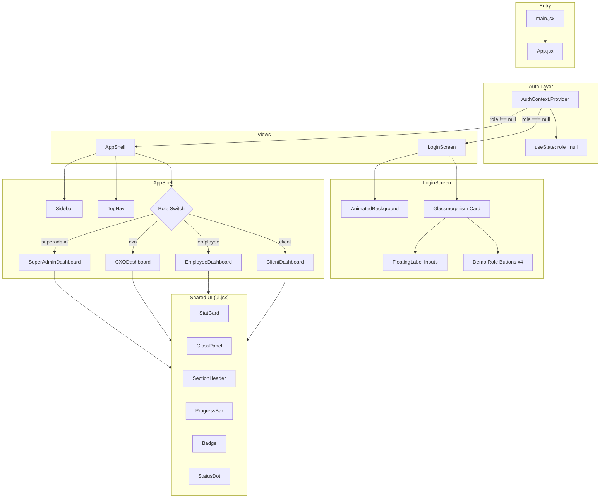

# Design Document: TaxFlow Auth & RBAC

## Overview

This design covers Authentication and Role-Based Access Control for TaxFlow Pro Phase 1. The system provides a mock authentication flow with four user roles (Super Admin, CXO/Partner, Employee/Tax Preparer, Client), each routing to a dedicated dashboard. The UI targets a premium glassmorphism aesthetic with dark mode, Framer Motion animations, and responsive layouts.

The existing codebase already has scaffolded components (LoginScreen, AppShell, Sidebar, TopNav, four dashboards) with inline styles and CSS keyframe animations. This design formalizes the architecture, fills gaps (form validation, Framer Motion integration, responsive behavior), and defines correctness properties for testable acceptance criteria.

### Key Design Decisions

1. **No React Router** — The app uses conditional rendering via AuthContext rather than URL-based routing. This is appropriate for a single-page demo with no deep-linking requirements.
2. **Framer Motion for all animations** — Replace CSS keyframe animations with Framer Motion's `motion` components and `AnimatePresence` for page transitions, staggered widget entry, and micro-interactions. This satisfies Requirement 12.
3. **AuthContext with useState** — Keep the existing simple `useState`-based context. No need for `useReducer` given the minimal state shape (a single role string or null).
4. **Mock data only** — All dashboard content uses hardcoded mock data arrays. No API layer needed for Phase 1.
5. **Tailwind CSS utilities** — Requirement 11.4 mandates Tailwind classes. The existing code uses inline styles extensively. The design recommends migrating glassmorphism patterns to Tailwind utility classes where specified.

## Architecture



### Component Tree

```
<App>
  <AuthContext.Provider>
    <AnimatePresence mode="wait">
      {!user ? (
        <LoginScreen>
          <AnimatedBackground />
          <motion.div> <!-- glass card -->
            <FloatingLabel /> <!-- email -->
            <FloatingLabel /> <!-- password -->
            <SubmitButton />
            <DemoRoleButton /> x4
          </motion.div>
        </LoginScreen>
      ) : (
        <AppShell>
          <Sidebar collapsed={bool} onToggle={fn} />
          <TopNav />
          <AnimatePresence mode="wait">
            <motion.main>
              <Dashboard /> <!-- role-specific -->
            </motion.main>
          </AnimatePresence>
        </AppShell>
      )}
    </AnimatePresence>
  </AuthContext.Provider>
</App>
```

## Components and Interfaces

### AuthContext (App.jsx)

```typescript
interface AuthContextValue {
  user: Role | null;          // Current authenticated role
  login: (role: Role) => void; // Sets role, triggers transition
  logout: () => void;          // Clears role, returns to login
}

type Role = 'superadmin' | 'cxo' | 'employee' | 'client';
```

**Behavior:**
- `login(role)` sets a transitioning flag, waits 400ms (for exit animation), then sets the user state
- `logout()` clears user to null immediately
- The Provider wraps the entire app; `useAuth()` hook provides access

### LoginScreen

**Props:** None (reads from AuthContext)

**Internal State:**
- `email: string` — email input value
- `password: string` — password input value
- `hoveredRole: string | null` — currently hovered demo button ID

**Subcomponents:**
- `AnimatedBackground` — Fixed-position layer with 3 radial gradient orbs using CSS float animations, grid overlay, and vignette
- `FloatingLabel` — Input with animated label that lifts on focus/value, border glow on focus, password toggle

**Validation Rules:**
- Submit button disabled when both email AND password are empty (Req 2.6)
- Email must be non-empty for form submission (Req 2.4)
- Password must be non-empty for form submission (Req 2.5)

**Demo Role Buttons:**
- Exactly 4 buttons: Super Admin, CXO/Partner, Employee/Tax Preparer, Client (Req 3.1)
- Each calls `login(roleId)` on click
- Hover micro-interaction: translateY(-2px), glow shadow, border color shift

### AppShell

**Props:** None (reads from AuthContext)

**Internal State:**
- `sidebarCollapsed: boolean` — sidebar expanded/collapsed

**Layout:**
- Fixed sidebar on left (width: 240px expanded, 72px collapsed)
- Sticky TopNav at top
- Scrollable main content area with role-specific dashboard

**Dashboard Selection:**
```javascript
const DASHBOARDS = {
  superadmin: SuperAdminDashboard,
  cxo: CXODashboard,
  employee: EmployeeDashboard,
  client: ClientDashboard,
}
const Dashboard = DASHBOARDS[user]
```

### Sidebar

**Props:**
```typescript
interface SidebarProps {
  collapsed: boolean;
  onToggle: () => void;
}
```

**Behavior:**
- Renders role-specific nav items from `NAV_ITEMS[role]` lookup
- Each item has a Lucide icon and label
- Collapse toggle button on the right edge (circular, absolute positioned)
- Width transition: 0.3s cubic-bezier
- User profile section at bottom with role initials, label, and logout button
- Hover micro-interaction on nav items: background highlight

### TopNav

**Props:** None (reads from AuthContext)

**Renders:**
- Date string (left)
- Box AI connection badge (center)
- Role badge, notification bell, avatar (right)
- Glassmorphism: `backdrop-filter: blur(20px)`, translucent background

### Dashboard Components

Each dashboard follows the same pattern:
1. `SectionHeader` with title and subtitle
2. Stats row using `StatCard` components in a 4-column grid
3. Content panels using `GlassPanel` wrappers
4. Staggered fade-in-up animations on load (Framer Motion `variants` with `staggerChildren`)

**SuperAdminDashboard:** System health stats, Box AI integration status panel, resource usage bars, recent users table
**CXODashboard:** Portfolio stats, compliance rate progress bars, filing progress breakdown, overdue alerts list
**EmployeeDashboard:** Workload stats, assigned clients list with status badges, Box AI insights panel
**ClientDashboard:** Welcome banner, tax year progress stepper, preparer requests list, upload dropzone with drag-and-drop

### Shared UI Components (ui.jsx)

| Component | Purpose |
|-----------|---------|
| `StatCard` | Metric card with label, value, change indicator, icon |
| `SectionHeader` | Dashboard title + subtitle |
| `GlassPanel` | Glassmorphism container with border, blur, rounded corners |
| `PanelTitle` | Uppercase section label inside panels |
| `StatusDot` | Colored circle indicator with optional pulse |
| `ProgressBar` | Horizontal bar with glow effect |
| `Badge` | Pill-shaped label with color theming |

## Data Models

### Role Configuration

```javascript
// Role identifiers used throughout the system
const ROLES = ['superadmin', 'cxo', 'employee', 'client']

// Role metadata for display
const ROLE_META = {
  superadmin: { label: 'Super Admin', color: '#a78bfa', initials: 'SA', badge: 'SYSTEM' },
  cxo:        { label: 'CXO / Partner', color: '#06b6d4', initials: 'CX', badge: 'EXECUTIVE' },
  employee:   { label: 'Tax Preparer', color: '#34d399', initials: 'TP', badge: 'PREPARER' },
  client:     { label: 'Client Portal', color: '#fbbf24', initials: 'CL', badge: 'CLIENT' },
}
```

### Navigation Items

```javascript
// Per-role sidebar navigation configuration
const NAV_ITEMS = {
  superadmin: [
    { icon: LayoutDashboard, label: 'Dashboard', active: true },
    { icon: Users, label: 'User Management' },
    { icon: Shield, label: 'Security & Audit' },
    { icon: Bot, label: 'Box AI Status' },
    { icon: Settings, label: 'System Config' },
  ],
  // ... similar for cxo, employee, client
}
```

### Mock Dashboard Data

All dashboard data is hardcoded as module-level constants. No persistence layer. Examples:

```javascript
// SuperAdmin
const API_SERVICES = [
  { name: 'Box AI Document Intelligence', status: 'operational', latency: '42ms', uptime: '99.98%', color: '#34d399' },
  // ...
]

// CXO
const FIRMS = [
  { name: 'Enterprises Division', docs: 1842, compliance: 94, status: 'good', trend: '+2.1%' },
  // ...
]

// Employee
const CLIENTS = [
  { name: 'Acme Industries LLC', type: 'Business', docs: 14, status: 'review', aiScore: 92 },
  // ...
]

// Client
const PREPARER_REQUESTS = [
  { title: 'Please upload your W-2', priority: 'urgent', due: 'Mar 12', done: false },
  // ...
]
```

### Auth State Shape

```javascript
// Minimal auth state — just the role string or null
{
  user: 'superadmin' | 'cxo' | 'employee' | 'client' | null
}
```

No user profile object, tokens, or session data needed for Phase 1 mock auth.


## Correctness Properties

*A property is a characteristic or behavior that should hold true across all valid executions of a system — essentially, a formal statement about what the system should do. Properties serve as the bridge between human-readable specifications and machine-verifiable correctness guarantees.*

### Property 1: Form submission requires non-empty credentials

*For any* form state where the email field is empty OR the password field is empty, the login form submission should be prevented (submit button disabled or submission blocked). Conversely, for any form state where both fields are non-empty, submission should be allowed.

**Validates: Requirements 2.4, 2.5, 2.6**

### Property 2: Login sets the authenticated role

*For any* valid role in {superadmin, cxo, employee, client}, calling `login(role)` on the AuthContext should result in the context's `user` value being set to that role.

**Validates: Requirements 3.2, 4.2**

### Property 3: Login then logout returns to unauthenticated state

*For any* valid role, calling `login(role)` followed by `logout()` should result in the context's `user` value being `null`.

**Validates: Requirements 4.3, 6.5**

### Property 4: Auth state exclusively determines the rendered view

*For any* auth state, the LoginScreen is rendered if and only if `user` is `null`, and the AppShell is rendered if and only if `user` is not `null`. Both views are never rendered simultaneously.

**Validates: Requirements 4.4, 4.5**

### Property 5: Role-to-dashboard mapping is correct

*For any* valid role, when that role is the authenticated user, the AppShell should render the corresponding dashboard component: superadmin → SuperAdminDashboard, cxo → CXODashboard, employee → EmployeeDashboard, client → ClientDashboard.

**Validates: Requirements 5.1, 5.2, 5.3, 5.4**

### Property 6: Sidebar collapse toggle is a round trip

*For any* initial sidebar state (expanded or collapsed), clicking the collapse toggle twice should return the sidebar to its original state.

**Validates: Requirements 6.3**

### Property 7: TopNav displays the current role name

*For any* authenticated role, the TopNav should display text matching that role's configured label from the ROLE_META mapping.

**Validates: Requirements 6.4**

### Property 8: Sidebar displays role-specific navigation items

*For any* authenticated role, the Sidebar should render exactly the navigation items defined in `NAV_ITEMS[role]`, each with its configured label and icon.

**Validates: Requirements 6.6**

## Error Handling

### Authentication Errors

| Scenario | Handling |
|----------|----------|
| Empty email on submit | Prevent submission; keep button disabled per validation rules |
| Empty password on submit | Prevent submission; keep button disabled per validation rules |
| Invalid role passed to `login()` | No explicit handling needed — only valid role IDs are wired to buttons. Defensive: ignore unknown roles. |
| Logout when already logged out | No-op — `setUser(null)` is idempotent |

### UI Edge Cases

| Scenario | Handling |
|----------|----------|
| Unknown role in DASHBOARDS map | Fallback to EmployeeDashboard (existing behavior) |
| Unknown role in NAV_ITEMS map | Fallback to employee nav items |
| Unknown role in ROLE_META map | Fallback to employee metadata |
| Sidebar collapse on narrow viewport | Auto-collapse below 1024px breakpoint |
| Drag-and-drop on non-file content | `handleDrop` reads `e.dataTransfer.files`; empty array is harmless |

### No Network Error Handling

Phase 1 uses mock data only. No API calls, no network errors, no loading states. All data is synchronous and hardcoded.

## Testing Strategy

### Testing Framework

- **Unit/Component Tests:** Vitest + React Testing Library
- **Property-Based Tests:** [fast-check](https://github.com/dubzzz/fast-check) (JavaScript PBT library)
- **Minimum iterations:** 100 per property test

### Unit Tests (Examples & Edge Cases)

Unit tests cover specific structural checks and edge cases:

- LoginScreen renders exactly 4 demo role buttons with correct labels (Req 3.1)
- LoginScreen renders email and password input fields (Req 2.1)
- SuperAdminDashboard renders system health, user management, and Box AI widgets (Req 7.1, 7.2, 7.3)
- CXODashboard renders portfolio, compliance rate, and overdue alerts (Req 8.1, 8.2, 8.3)
- EmployeeDashboard renders assigned clients, pending review, and AI insights (Req 9.1, 9.2, 9.3)
- ClientDashboard renders progress widget, preparer requests, and upload dropzone (Req 10.1, 10.2, 10.3)
- ClientDashboard dropzone highlights on drag-over (Req 10.4)
- LoginScreen card has border-radius >= 16px (Req 1.4)
- Sidebar renders in AppShell (Req 6.2)
- Sidebar auto-collapses at viewport < 1024px (Req 11.2)
- LoginScreen stacks vertically at viewport < 768px (Req 11.1)

### Property-Based Tests

Each correctness property maps to a single property-based test using fast-check:

1. **Feature: taxflow-auth-rbac, Property 1: Form submission requires non-empty credentials** — Generate arbitrary strings for email/password, verify submission is blocked iff either is empty
2. **Feature: taxflow-auth-rbac, Property 2: Login sets the authenticated role** — Generate random role from the valid set, call login, verify user state
3. **Feature: taxflow-auth-rbac, Property 3: Login then logout returns to unauthenticated state** — Generate random role, login then logout, verify user is null
4. **Feature: taxflow-auth-rbac, Property 4: Auth state exclusively determines the rendered view** — Generate random auth states (null or valid role), verify correct view renders
5. **Feature: taxflow-auth-rbac, Property 5: Role-to-dashboard mapping is correct** — Generate random role, verify correct dashboard component is selected
6. **Feature: taxflow-auth-rbac, Property 6: Sidebar collapse toggle is a round trip** — Generate random initial collapsed state, toggle twice, verify return to original
7. **Feature: taxflow-auth-rbac, Property 7: TopNav displays the current role name** — Generate random role, verify TopNav contains role label
8. **Feature: taxflow-auth-rbac, Property 8: Sidebar displays role-specific navigation items** — Generate random role, verify sidebar nav items match NAV_ITEMS config

### Test Configuration

```javascript
// fast-check configuration for all property tests
fc.assert(
  fc.property(/* arbitraries */, (/* values */) => {
    // property assertion
  }),
  { numRuns: 100 }
)
```

Each property test file should include a comment referencing the design property:
```javascript
// Feature: taxflow-auth-rbac, Property N: <property title>
```
