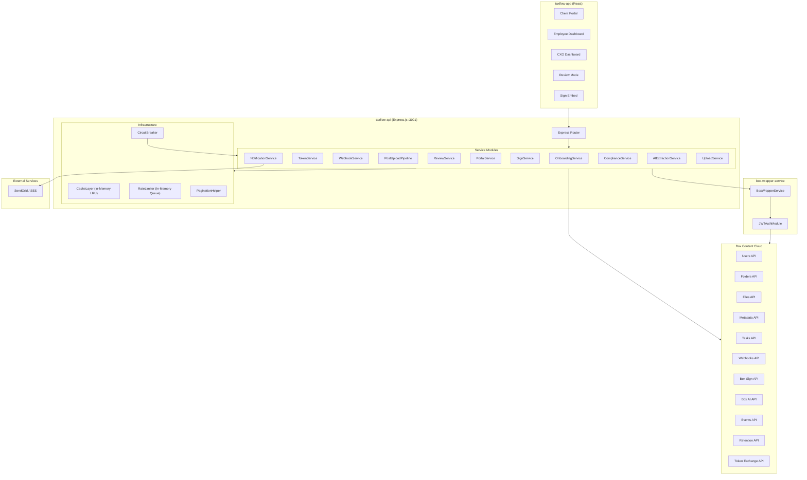
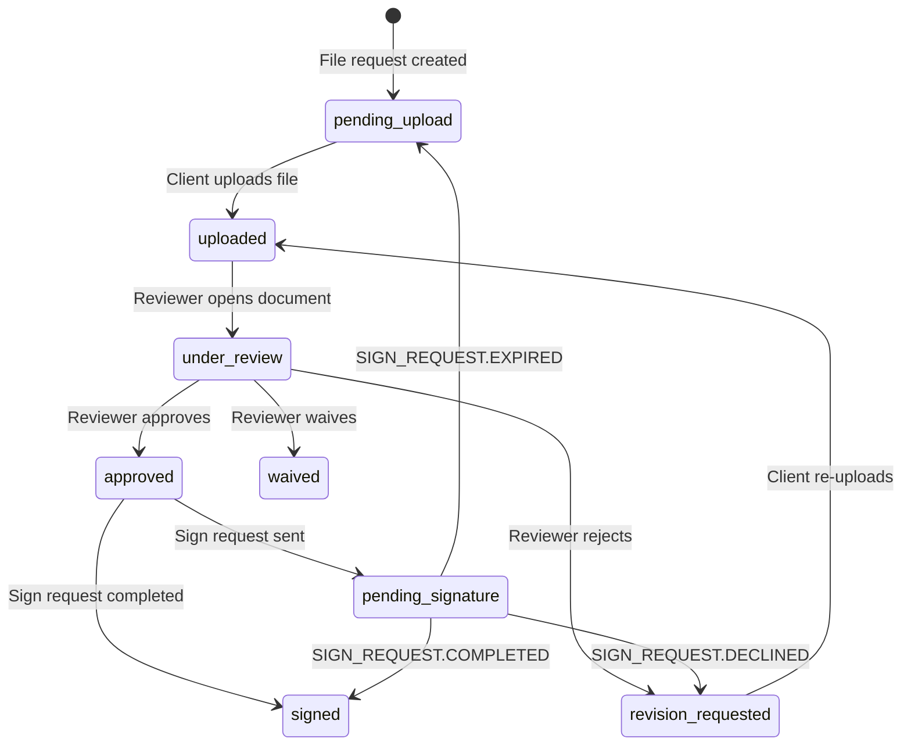

# Design Document: TaxFlow Box Integration

## Overview

This design covers the comprehensive Box Platform integration layer for TaxFlow Pro — a set of backend service modules built into the existing `taxflow-api/` Express.js project that orchestrate the full lifecycle of tax document management. The services sit between the existing `box-wrapper-service/` (JWT auth, SDK init, schema sync, vault creation) and the `taxflow-app/` React frontend (auth/RBAC dashboards, document workflow components).

The integration spans 15 service modules covering: client onboarding with App User provisioning, token management with downscoped access, webhook automation, post-upload pipelines, review workflows, e-signatures via Box Sign, compliance enforcement (retention, legal holds, classifications), AI-powered extraction, and infrastructure concerns (caching, rate limiting, circuit breaking, chunked uploads, pagination).

### Key Design Decisions

1. **Extend existing taxflow-api** — All new services are added as modules under `taxflow-api/src/services/` with corresponding routes under `taxflow-api/src/routes/`. No new standalone project is created.
2. **Box as single source of truth** — Box Content Cloud serves as file system, metadata store, and security layer. The `taxflow_document` metadata template replaces external database storage for document lifecycle state.
3. **Layered token strategy** — Service Account tokens for admin ops, App User tokens for client-scoped ops, downscoped tokens for frontend embedding. All cached in-memory with proactive refresh.
4. **Event-driven automation** — Webhook events drive the post-upload pipeline, revision flow, and sign completion. HMAC-SHA256 verification ensures authenticity.
5. **Infrastructure resilience** — In-memory LRU cache with TTL support, in-memory priority queue rate limiter, circuit breaker with half-open probe recovery.
6. **ES modules throughout** — Consistent with the existing `taxflow-api/` codebase using `import/export` syntax.
7. **Box Node SDK v10** — Reuses the existing `box-wrapper-service` for SDK initialization and JWT auth. New services call the SDK client directly for Box API operations not covered by the wrapper.

## Architecture



### Onboarding Flow Sequence

```mermaid
sequenceDiagram
    participant Client as Admin UI
    participant API as taxflow-api
    participant Onboard as OnboardingService
    participant Token as TokenService
    participant Webhook as WebhookService
    participant Box as Box Content Cloud

    Client->>API: POST /api/onboarding
    API->>Onboard: onboardClient(clientData)
    
    Note over Onboard,Box: Phase 1: App User Creation
    Onboard->>Box: POST /users (is_platform_access_only: true)
    alt 409 Conflict
        Box-->>Onboard: Existing user
        Onboard->>Box: GET /users?filter_term=email
        Box-->>Onboard: Existing user_id
    else Success
        Box-->>Onboard: New user_id
    end

    Note over Onboard,Box: Phase 2: Folder Hierarchy
    Onboard->>Box: POST /folders (root: "{name} ({extId})")
    Box-->>Onboard: root folder_id
    Onboard->>Box: POST /folders (year: "2025")
    Box-->>Onboard: year folder_id
    loop 5 subfolders
        Onboard->>Box: POST /folders (Tax, Uploads, SupportingDocs, SignedDocuments, InternalNotes)
        Box-->>Onboard: subfolder_id
    end

    Note over Onboard,Box: Phase 3: Folder Locks
    Onboard->>Box: POST /folder_locks (root, SignedDocuments, InternalNotes)
    Box-->>Onboard: lock_ids

    Note over Onboard,Box: Phase 4: Collaborations
    Onboard->>Box: POST /collaborations (per permission matrix)
    Box-->>Onboard: collaboration_ids

    Note over Onboard,Box: Phase 5: Webhook Registration
    Onboard->>Webhook: registerWebhook(rootFolderId)
    Webhook->>Box: POST /webhooks
    Box-->>Webhook: webhook_id + signature keys

    Onboard-->>API: OnboardingResult (manifest)
    API-->>Client: 201 Created
```

### Post-Upload Pipeline Sequence

```mermaid
sequenceDiagram
    participant Box as Box Cloud
    participant WH as WebhookService
    participant Pipe as PostUploadPipeline
    participant Review as ReviewService
    participant Notify as NotificationService
    participant AI as AIExtractionService

    Box->>WH: POST /api/webhooks/box (FILE.UPLOADED)
    WH->>WH: Verify HMAC-SHA256 signatures
    WH->>Pipe: processUploadEvent(event)
    
    alt New Upload
        Pipe->>Box: POST /files/{id}/metadata/enterprise/taxflow_document
        Pipe->>Box: POST /tasks (action: review)
        Pipe->>Box: POST /tasks/{id}/assignments
        Pipe->>AI: extractStructuredData(fileId)
        AI->>Box: POST /ai/extract_structured
        Box-->>AI: Extraction result
        AI->>Box: PATCH /files/{id}/metadata (extracted fields)
        Pipe->>Notify: dispatch("document_uploaded", reviewer)
    else Re-upload (revision_requested exists)
        Pipe->>Box: PATCH /files/{id}/metadata (status: "uploaded", clear comments)
        Pipe->>Box: POST /tasks (new assignment for original reviewer)
        Pipe->>Box: POST /comments ("Re-uploaded by client")
        Pipe->>Notify: dispatch("document_reuploaded", reviewer)
    end
```

### Review Workflow Sequence

```mermaid
sequenceDiagram
    participant UI as Employee UI
    participant API as taxflow-api
    participant Review as ReviewService
    participant Notify as NotificationService
    participant Box as Box Cloud

    UI->>API: POST /api/reviews/{fileId}/approve
    API->>Review: approveDocument(fileId, employeeId)
    Review->>Box: PATCH /files/{id}/metadata (status: approved, reviewer, reviewed_at)
    Review->>Box: PUT /tasks/{id}/assignments/{id} (status: completed)
    Review->>Notify: dispatch("document_approved", clientId)
    Review-->>API: { success: true }
    API-->>UI: 200 OK

    UI->>API: POST /api/reviews/{fileId}/reject
    API->>Review: rejectDocument(fileId, employeeId, reason)
    Review->>Box: PATCH /files/{id}/metadata (status: revision_requested, comments)
    Review->>Box: POST /comments (rejection reason, tagged client)
    Review->>Notify: dispatch("revision_requested", clientId, reason)
    Note over Review: Task NOT completed — remains open for re-review
    Review-->>API: { success: true }
    API-->>UI: 200 OK
```

### Box Sign Flow Sequence

```mermaid
sequenceDiagram
    participant UI as Employee UI
    participant API as taxflow-api
    participant Sign as SignService
    participant Box as Box Cloud
    participant WH as WebhookService
    participant Notify as NotificationService

    UI->>API: POST /api/sign/request
    API->>Sign: createSignRequest(fileId, signerEmail, options)
    Sign->>Box: POST /sign_requests
    Box-->>Sign: sign_request (id, embed_url)
    Sign->>Box: PATCH /files/{id}/metadata (status: pending_signature)
    Sign-->>API: { signRequestId, embedUrl }
    API-->>UI: 200 OK

    Note over Box,WH: Later — signer completes
    Box->>WH: SIGN_REQUEST.COMPLETED
    WH->>Sign: handleSignEvent(event)
    Sign->>Box: PATCH /files/{id}/metadata (status: signed)
    Sign->>Box: POST /files/{id}/copy (to SignedDocuments)
    Sign->>Notify: dispatch("signature_completed", employee + client)
```

## Components and Interfaces

### OnboardingService

```typescript
// taxflow-api/src/services/onboardingService.js

interface AppUserResult {
  userId: string;
  login: string;
  name: string;
  isNew: boolean;
}

interface FolderManifest {
  root: string;
  year: string;
  tax: string;
  uploads: string;
  supportingDocs: string;
  signedDocuments: string;
  internalNotes: string;
}

interface OnboardingResult {
  appUser: AppUserResult;
  folders: FolderManifest;
  locks: { folderId: string; lockId: string; success: boolean }[];
  collaborations: { folderId: string; role: string; success: boolean }[];
  webhookId: string;
  fileRequestUrl?: string;
}

class OnboardingService {
  /**
   * Full client onboarding: App User → folders → locks → collabs → webhook → file request.
   * @param clientName - Display name
   * @param externalId - Auth provider ID
   * @param email - Client email
   * @param employeeEmail - Assigned employee email
   * @param financialYear - Tax year (default: current year)
   * @returns Complete onboarding manifest
   */
  async onboardClient(
    clientName: string,
    externalId: string,
    email: string,
    employeeEmail: string,
    financialYear?: string
  ): Promise<OnboardingResult>;

  /** Creates Box App User with is_platform_access_only: true. Handles 409 conflict. */
  async createAppUser(name: string, email: string, spaceAmount?: number): Promise<AppUserResult>;

  /** Creates root → year → 5 subfolders. Returns manifest mapping folder type to ID. */
  async createFolderHierarchy(
    clientName: string,
    externalId: string,
    parentFolderId: string,
    financialYear: string
  ): Promise<FolderManifest>;

  /** Applies folder locks to root, SignedDocuments, InternalNotes. Continues on failure. */
  async applyFolderLocks(manifest: FolderManifest): Promise<{ folderId: string; lockId: string; success: boolean }[]>;

  /** Sets up collaborations per permission matrix. Handles 409 conflicts. */
  async setupCollaborations(
    manifest: FolderManifest,
    appUserId: string,
    employeeEmail: string
  ): Promise<{ folderId: string; role: string; success: boolean }[]>;

  /** Creates a file request for guest uploads to the Uploads folder. */
  async createFileRequest(
    uploadsFolderId: string,
    title: string,
    expiresAt: string
  ): Promise<{ url: string; fileRequestId: string }>;
}
```

### TokenService

```typescript
// taxflow-api/src/services/tokenService.js

type TokenScope = 'item_preview' | 'item_download' | 'item_upload' | 'item_readwrite';

interface TokenResult {
  accessToken: string;
  expiresIn: number;
  expiresAt: string; // ISO 8601
  tokenType: string;
}

class TokenService {
  /**
   * Generates a Service Account token for admin operations.
   * Cached with TTL at 90% of expiry.
   */
  async getServiceAccountToken(): Promise<TokenResult>;

  /**
   * Generates an App User token for client-scoped operations.
   * @param userId - Box App User ID
   */
  async getAppUserToken(userId: string): Promise<TokenResult>;

  /**
   * Generates a downscoped token restricted to specific resource and scope.
   * @param parentToken - App User token to downscope
   * @param scope - Permission scope
   * @param resourceUrl - Box resource URL (file or folder)
   */
  async getDownscopedToken(
    parentToken: string,
    scope: TokenScope,
    resourceUrl: string
  ): Promise<TokenResult>;

  /**
   * Generates a preview token for Box Content Preview embedding.
   * @param fileId - Box file ID
   * @param userId - App User ID for the parent token
   * @returns Token with max 60-minute TTL
   */
  async getPreviewToken(fileId: string, userId: string): Promise<TokenResult>;

  /** Proactively refreshes tokens within 10% of expiry. */
  async refreshIfNeeded(cacheKey: string): Promise<TokenResult | null>;
}
```

### WebhookService

```typescript
// taxflow-api/src/services/webhookService.js

interface WebhookRegistration {
  webhookId: string;
  primaryKey: string;
  secondaryKey: string;
  address: string;
  triggers: string[];
}

interface WebhookEvent {
  type: string;       // e.g., "FILE.UPLOADED"
  trigger: string;
  source: {
    id: string;
    type: string;     // "file" | "folder"
    name: string;
    parent?: { id: string; name: string };
  };
  created_by: { id: string; login: string };
  created_at: string;
}

class WebhookService {
  /**
   * Registers a webhook on a folder for file events.
   * Handles 409 conflict by retrieving existing webhook.
   */
  async registerWebhook(
    folderId: string,
    triggers?: string[]
  ): Promise<WebhookRegistration>;

  /**
   * Verifies webhook payload using HMAC-SHA256 with constant-time comparison.
   * Checks primary key first, falls back to secondary.
   * @returns true if signature is valid
   */
  verifySignature(
    body: Buffer,
    primarySignature: string,
    secondarySignature: string,
    primaryKey: string,
    secondaryKey: string
  ): boolean;

  /**
   * Routes verified webhook events to appropriate handlers.
   */
  async processEvent(event: WebhookEvent): Promise<void>;
}
```

### PostUploadPipeline

```typescript
// taxflow-api/src/services/postUploadPipeline.js

interface PipelineResult {
  fileId: string;
  metadataApplied: boolean;
  taskId?: string;
  taskAssignmentId?: string;
  isRevision: boolean;
  notificationSent: boolean;
}

class PostUploadPipeline {
  /**
   * Processes a FILE.UPLOADED event: applies metadata, creates task, notifies reviewer.
   * Detects revision flow when existing file has status "revision_requested".
   */
  async processUpload(event: WebhookEvent): Promise<PipelineResult>;

  /**
   * Applies taxflow_document metadata template to a newly uploaded file.
   * Sets client_id, status: "uploaded", financial_year, priority: "normal".
   */
  async applyMetadata(
    fileId: string,
    clientId: string,
    financialYear: string
  ): Promise<void>;

  /**
   * Creates a review task and assigns it to the designated reviewer.
   */
  async createReviewTask(
    fileId: string,
    reviewerEmail: string
  ): Promise<{ taskId: string; assignmentId: string }>;

  /**
   * Handles re-upload: resets status to "uploaded", clears comments,
   * creates new task for original reviewer, adds re-upload comment.
   */
  async handleRevision(
    fileId: string,
    originalReviewer: string
  ): Promise<PipelineResult>;
}
```

### ReviewService

```typescript
// taxflow-api/src/services/reviewService.js

interface ReviewResult {
  fileId: string;
  status: DocumentStatus;
  reviewer: string;
  reviewedAt: string;
  taskCompleted: boolean;
}

interface BulkApproveResult {
  total: number;
  succeeded: number;
  failed: { fileId: string; error: string }[];
}

interface InternalNote {
  fileId: string;
  fileName: string;
  author: string;
  subject: string;
  createdAt: string;
  documentType: string;
}

class ReviewService {
  /**
   * Approves a document: updates metadata, completes task, notifies client.
   * Uses JSON Patch operations for atomic metadata updates.
   */
  async approveDocument(fileId: string, employeeId: string): Promise<ReviewResult>;

  /**
   * Rejects a document: updates metadata with comments, creates file comment,
   * notifies client. Task remains open for re-review.
   * @throws HTTP 400 if rejectionReason is empty
   */
  async rejectDocument(
    fileId: string,
    employeeId: string,
    rejectionReason: string
  ): Promise<ReviewResult>;

  /**
   * Waives a document requirement: updates metadata, completes task, notifies client.
   */
  async waiveDocument(
    fileId: string,
    employeeId: string,
    waiveReason: string
  ): Promise<ReviewResult>;

  /**
   * Bulk approves documents with max concurrency of 5.
   * Continues on individual failures.
   */
  async bulkApprove(
    fileIds: string[],
    employeeId: string
  ): Promise<BulkApproveResult>;

  /**
   * Creates an internal note in the InternalNotes subfolder.
   * Named: {timestamp}_{author}_{subject}.txt
   */
  async createInternalNote(
    clientFolderId: string,
    author: string,
    subject: string,
    content: string
  ): Promise<InternalNote>;

  /**
   * Lists internal notes sorted by creation date descending.
   */
  async listInternalNotes(clientFolderId: string): Promise<InternalNote[]>;
}
```

### PortalService

```typescript
// taxflow-api/src/services/portalService.js

interface ClientProgress {
  clientId: string;
  documents: {
    fileId: string;
    fileName: string;
    documentType: string;
    status: DocumentStatus;
    priority: string;
    reviewedAt?: string;
    reviewComments?: string;
  }[];
  statusCounts: Record<DocumentStatus, number>;
}

interface EmployeeDashboard {
  pendingReviews: {
    fileId: string;
    fileName: string;
    clientName: string;
    priority: string;
    uploadedAt: string;
    isOverdue: boolean;
  }[];
  clientChecklists: {
    clientId: string;
    clientName: string;
    totalRequired: number;
    submitted: number;
    approved: number;
    pending: number;
  }[];
}

interface CXOPortfolio {
  clients: {
    clientName: string;
    totalDocuments: number;
    approved: number;
    pending: number;
    revisions: number;
    completionPercentage: number;
  }[];
  firmTotals: {
    totalClients: number;
    totalDocuments: number;
    complianceRate: number;
    overdueClients: number;
  };
}

interface PaginatedResponse<T> {
  data: T;
  nextCursor?: string;
  limit: number;
  totalCount?: number;
}

class PortalService {
  /** Client progress via metadata query, cached 60s. */
  async getClientProgress(clientId: string): Promise<ClientProgress>;

  /** Employee dashboard: pending reviews sorted by priority, cached 30s. */
  async getEmployeeDashboard(employeeId: string): Promise<EmployeeDashboard>;

  /** CXO portfolio: cross-client aggregation, cached 120s. */
  async getCXOPortfolio(cursor?: string, limit?: number): Promise<PaginatedResponse<CXOPortfolio>>;

  /** Detects clients with no activity within threshold. */
  async getInactiveClients(thresholdDays?: number): Promise<{ clientId: string; clientName: string; lastActivity: string }[]>;

  /** File version history sorted by version number descending. */
  async getFileVersions(fileId: string): Promise<{
    versionId: string;
    name: string;
    size: number;
    modifiedBy: string;
    modifiedAt: string;
    versionNumber: number;
  }[]>;

  /** Creates zip download and returns download URL. Max 100 files. */
  async createZipDownload(fileIds: string[]): Promise<{ downloadUrl: string }>;
}
```

### SignService

```typescript
// taxflow-api/src/services/signService.js

interface SignRequestResult {
  signRequestId: string;
  embedUrl?: string;
  status: string;
}

class SignService {
  /**
   * Creates a Box Sign request with signer config and redirect URLs.
   * Updates file metadata status to "pending_signature".
   */
  async createSignRequest(
    fileId: string,
    signerEmail: string,
    signedDocsFolderId: string,
    options?: { isEmbedded?: boolean; redirectUrl?: string; declinedRedirectUrl?: string }
  ): Promise<SignRequestResult>;

  /**
   * Processes sign webhook events: COMPLETED, DECLINED, EXPIRED.
   * Updates metadata and dispatches notifications.
   */
  async handleSignEvent(event: WebhookEvent): Promise<void>;
}
```

### NotificationService

```typescript
// taxflow-api/src/services/notificationService.js

type NotificationEventType =
  | 'document_uploaded'
  | 'document_approved'
  | 'revision_requested'
  | 'document_waived'
  | 'signature_requested'
  | 'signature_completed'
  | 'signature_declined'
  | 'signature_expired'
  | 'document_reuploaded';

interface Notification {
  id: string;
  recipientId: string;
  eventType: NotificationEventType;
  message: string;
  documentReference: { fileId: string; fileName: string };
  deepLinkUrl: string;
  read: boolean;
  createdAt: string;
}

interface DeepLinkPayload {
  fileId: string;
  clientId: string;
  action: 'view' | 'upload' | 'sign';
  exp: number;
}

class NotificationService {
  /**
   * Translates a Box event into a business notification and dispatches
   * via email and in-app channels.
   */
  async dispatch(
    eventType: NotificationEventType,
    recipientId: string,
    context: { fileId: string; fileName: string; clientId: string; message?: string }
  ): Promise<void>;

  /**
   * Generates a signed JWT deep-link token (72-hour expiry).
   */
  generateDeepLinkToken(payload: DeepLinkPayload): string;

  /**
   * Verifies and decodes a deep-link token.
   * @throws HTTP 401 if expired or invalid signature
   */
  verifyDeepLinkToken(token: string): DeepLinkPayload;

  /** Sends email via SendGrid/SES with deep-link URL. Retries 3x with exponential backoff. */
  async sendEmail(recipientEmail: string, templateId: string, context: Record<string, string>): Promise<void>;

  /** Stores in-app notification in memory for retrieval by frontend. Notifications are ephemeral and reset on server restart. */
  async storeInAppNotification(notification: Notification): Promise<void>;
}
```

### ComplianceService

```typescript
// taxflow-api/src/services/complianceService.js

interface RetentionPolicyResult {
  policyId: string;
  policyName: string;
  retentionLength: number;
}

interface LegalHoldResult {
  policyId: string;
  assignmentId: string;
  targetId: string;
  targetType: 'file' | 'folder';
}

class ComplianceService {
  /**
   * Ensures 7-year retention policy exists. Creates if missing, retrieves if 409.
   */
  async ensureRetentionPolicy(): Promise<RetentionPolicyResult>;

  /**
   * Assigns retention policy to an approved file.
   */
  async assignRetentionPolicy(fileId: string): Promise<{ assignmentId: string }>;

  /**
   * Creates a legal hold policy and assigns it to a target.
   */
  async createLegalHold(
    policyName: string,
    description: string,
    targetId: string,
    targetType: 'file' | 'folder'
  ): Promise<LegalHoldResult>;

  /**
   * Releases a legal hold by deleting the assignment.
   */
  async releaseLegalHold(assignmentId: string): Promise<void>;

  /**
   * Applies security classification to a file.
   * Uses POST for new, PATCH for existing.
   */
  async applyClassification(
    fileId: string,
    level: 'Public' | 'Internal' | 'Confidential'
  ): Promise<void>;
}
```

### AIExtractionService

```typescript
// taxflow-api/src/services/aiExtractionService.js

interface ExtractionResult {
  fileId: string;
  extractedFields: Record<string, string>;
  confidenceScores: Record<string, number>;
  lowConfidenceFields: string[];
  flaggedForManualReview: boolean;
}

interface ValidationResult {
  fileId: string;
  isComplete: boolean;
  missingFields: string[];
  warnings: string[];
  confidenceScore: number;
}

class AIExtractionService {
  /**
   * Runs Box AI structured extraction against the taxflow_document template.
   * Flags low-confidence fields (< 60%) for manual review.
   */
  async extractStructuredData(fileId: string): Promise<ExtractionResult>;

  /**
   * Validates document completeness via Box AI ask endpoint.
   * Sets priority to "high" if incomplete.
   */
  async validateDocument(fileId: string, documentType: string): Promise<ValidationResult>;

  /**
   * Ensures custom TaxFlow AI agent exists. Creates if missing.
   * Falls back to default extraction if creation fails.
   */
  async ensureAIAgent(): Promise<{ agentId: string } | null>;
}
```

### CacheLayer

```typescript
// taxflow-api/src/services/cacheLayer.js

class CacheLayer {
  /**
   * Gets a cached value. Returns null if not found.
   */
  async get(key: string): Promise<any | null>;

  /**
   * Sets a cached value with TTL in seconds.
   */
  async set(key: string, value: any, ttlSeconds: number): Promise<void>;

  /**
   * Deletes a cached entry.
   */
  async del(key: string): Promise<void>;

  /**
   * Cache-through pattern: returns cached value or executes fetcher and caches result.
   */
  async getOrFetch<T>(key: string, ttlSeconds: number, fetcher: () => Promise<T>): Promise<T>;
}
```

### RateLimiter

```typescript
// taxflow-api/src/services/rateLimiter.js

type Priority = 'urgent' | 'high' | 'normal' | 'low';

interface QueuedRequest<T> {
  jobId: string;
  priority: Priority;
  execute: () => Promise<T>;
}

class RateLimiter {
  /**
   * Enqueues a Box API request with priority using an in-memory priority queue.
   * Enforces max 10 concurrent requests/second.
   * Handles 429 responses with Retry-After re-queuing.
   */
  async enqueue<T>(
    execute: () => Promise<T>,
    priority?: Priority
  ): Promise<T>;

  /**
   * Returns current queue depth.
   * Rejects low-priority requests when depth > 1000.
   */
  async getQueueDepth(): Promise<number>;
}
```

### CircuitBreaker

```typescript
// taxflow-api/src/services/circuitBreaker.js

type CircuitState = 'closed' | 'open' | 'half-open';

class CircuitBreaker {
  /**
   * Wraps a Box API call with circuit breaker logic.
   * Tracks failures over 60-second rolling window.
   * Opens at >50% failure rate with min 10 requests.
   */
  async execute<T>(fn: () => Promise<T>): Promise<T>;

  /** Returns current circuit state. */
  getState(): CircuitState;

  /** Registers a listener for state change events. */
  onStateChange(listener: (from: CircuitState, to: CircuitState) => void): void;
}
```

### UploadService

```typescript
// taxflow-api/src/services/uploadService.js

interface UploadResult {
  fileId: string;
  fileName: string;
  size: number;
  sha1: string;
}

class UploadService {
  /**
   * Uploads a file. Uses chunked upload for files > 50MB.
   * @param folderId - Target folder
   * @param fileName - File name
   * @param fileBuffer - File content
   * @param fileSize - Total file size in bytes
   */
  async upload(
    folderId: string,
    fileName: string,
    fileBuffer: Buffer,
    fileSize: number
  ): Promise<UploadResult>;

  /**
   * Chunked upload: creates session, uploads 8MB chunks, commits with SHA-1.
   * Retries failed chunks up to 3 times. Aborts session on persistent failure.
   */
  async chunkedUpload(
    folderId: string,
    fileName: string,
    fileBuffer: Buffer,
    fileSize: number
  ): Promise<UploadResult>;
}
```

### PaginationHelper

```typescript
// taxflow-api/src/services/paginationHelper.js

interface PaginationOptions {
  marker?: string;
  limit?: number; // default 50, max 200
}

interface PaginatedResult<T> {
  entries: T[];
  nextMarker?: string;
  limit: number;
}

class PaginationHelper {
  /**
   * Wraps a Box API call with marker-based pagination.
   * Clamps limit to [1, 200] range.
   */
  async paginate<T>(
    apiFn: (marker?: string, limit?: number) => Promise<{ entries: T[]; next_marker?: string }>,
    options?: PaginationOptions
  ): Promise<PaginatedResult<T>>;

  /**
   * Collects all pages into a single array. Use for aggregation queries.
   * Processes in batches of 100.
   */
  async collectAll<T>(
    apiFn: (marker?: string, limit?: number) => Promise<{ entries: T[]; next_marker?: string }>
  ): Promise<T[]>;
}
```

## Data Models

### Metadata Template: taxflow_document

| Field Key | Display Name | Type | Queryable | Notes |
|-----------|-------------|------|-----------|-------|
| `client_id` | Client ID | String | Yes | Maps to auth provider user ID |
| `engagement_id` | Engagement ID | String | Yes | Associates document with engagement |
| `request_id` | Request ID | String | No | Links to specific document request |
| `document_type` | Document Type | String | No | e.g., "W-2", "1099", "1040", "internal_note" |
| `financial_year` | Financial Year | String | No | e.g., "2025" |
| `status` | Status | Enum | Yes | pending_upload, uploaded, under_review, approved, revision_requested, waived, signed |
| `reviewer` | Reviewer | String | No | Employee identifier |
| `review_comments` | Review Comments | String | No | Rejection/waive reason |
| `reviewed_at` | Reviewed At | Date | No | ISO 8601 timestamp |
| `priority` | Priority | Enum | No | low, normal, high, urgent |

### Template Definition (SDK Format)

```javascript
const TAXFLOW_DOCUMENT_TEMPLATE = {
  scope: 'enterprise',
  displayName: 'TaxFlow Document',
  templateKey: 'taxflow_document',
  fields: [
    { type: 'string', key: 'client_id', displayName: 'Client ID' },
    { type: 'string', key: 'engagement_id', displayName: 'Engagement ID' },
    { type: 'string', key: 'request_id', displayName: 'Request ID' },
    { type: 'string', key: 'document_type', displayName: 'Document Type' },
    { type: 'string', key: 'financial_year', displayName: 'Financial Year' },
    {
      type: 'enum',
      key: 'status',
      displayName: 'Status',
      options: [
        { key: 'pending_upload' },
        { key: 'uploaded' },
        { key: 'under_review' },
        { key: 'approved' },
        { key: 'revision_requested' },
        { key: 'waived' },
        { key: 'signed' },
      ],
    },
    { type: 'string', key: 'reviewer', displayName: 'Reviewer' },
    { type: 'string', key: 'review_comments', displayName: 'Review Comments' },
    { type: 'date', key: 'reviewed_at', displayName: 'Reviewed At' },
    {
      type: 'enum',
      key: 'priority',
      displayName: 'Priority',
      options: [
        { key: 'low' },
        { key: 'normal' },
        { key: 'high' },
        { key: 'urgent' },
      ],
    },
  ],
};
```

### Document Status State Machine



### Permission Matrix

| Folder | Client (App User) | Employee | Admin |
|--------|-------------------|----------|-------|
| Root | — | editor | co-owner |
| Tax | viewer | editor | co-owner |
| Uploads | viewer_uploader | editor | co-owner |
| SupportingDocs | viewer_uploader | editor | co-owner |
| SignedDocuments | viewer | viewer | co-owner |
| InternalNotes | — (no access) | editor | co-owner |

### API Request/Response Types

```typescript
// POST /api/onboarding
interface OnboardingRequest {
  clientName: string;
  externalId: string;
  email: string;
  employeeEmail: string;
  financialYear?: string;
}
// Response: OnboardingResult (201)

// POST /api/reviews/:fileId/approve
// No body required
// Response: ReviewResult (200)

// POST /api/reviews/:fileId/reject
interface RejectRequest {
  reason: string; // required, non-empty
}
// Response: ReviewResult (200)

// POST /api/reviews/:fileId/waive
interface WaiveRequest {
  reason: string;
}
// Response: ReviewResult (200)

// POST /api/reviews/bulk-approve
interface BulkApproveRequest {
  fileIds: string[]; // max concurrency: 5
}
// Response: BulkApproveResult (200)

// GET /api/portal/client/:clientId/progress
// Response: ClientProgress (200)

// GET /api/portal/employee/:employeeId/dashboard
// Response: EmployeeDashboard (200)

// GET /api/portal/cxo/portfolio?cursor=&limit=
// Response: PaginatedResponse<CXOPortfolio> (200)

// POST /api/sign/request
interface SignRequest {
  fileId: string;
  signerEmail: string;
  signedDocsFolderId: string;
  isEmbedded?: boolean;
}
// Response: SignRequestResult (200)

// POST /api/webhooks/box
// Body: raw webhook payload
// Headers: BOX-SIGNATURE-PRIMARY, BOX-SIGNATURE-SECONDARY
// Response: 200 OK or 403 Forbidden

// GET /api/portal/files/:fileId/versions
// Response: FileVersion[] (200)

// POST /api/portal/zip-download
interface ZipDownloadRequest {
  fileIds: string[]; // max 100
}
// Response: { downloadUrl: string } (200)

// POST /api/tokens/preview
interface PreviewTokenRequest {
  fileId: string;
  userId: string;
}
// Response: TokenResult (200)

// GET /api/notifications/:recipientId
// Response: Notification[] (200)

// GET /api/deep-link?token=xxx
// Response: 302 Redirect or 401 Unauthorized
```

### Environment Configuration Extensions

```javascript
// taxflow-api/src/config.js additions
export const config = {
  // ... existing config
  
  // Webhooks
  webhookEndpointUrl: process.env.WEBHOOK_ENDPOINT_URL || 'https://localhost:3001/api/webhooks/box',
  
  // Deep Links
  deepLinkSecret: process.env.DEEP_LINK_SECRET || '',
  deepLinkExpiryHours: parseInt(process.env.DEEP_LINK_EXPIRY_HOURS || '72'),

  // Notifications
  sendgridApiKey: process.env.SENDGRID_API_KEY || '',
  emailFrom: process.env.EMAIL_FROM || '[email]',

  // Rate Limiting
  maxConcurrentRequests: parseInt(process.env.MAX_CONCURRENT_REQUESTS || '10'),
  maxQueueDepth: parseInt(process.env.MAX_QUEUE_DEPTH || '1000'),

  // Circuit Breaker
  circuitBreakerWindowMs: parseInt(process.env.CB_WINDOW_MS || '60000'),
  circuitBreakerThreshold: parseFloat(process.env.CB_THRESHOLD || '0.5'),
  circuitBreakerCooldownMs: parseInt(process.env.CB_COOLDOWN_MS || '30000'),

  // Inactive Detection
  inactiveThresholdDays: parseInt(process.env.INACTIVE_THRESHOLD_DAYS || '30'),

  // Upload
  chunkSizeMb: parseInt(process.env.CHUNK_SIZE_MB || '8'),
  chunkedUploadThresholdMb: parseInt(process.env.CHUNKED_UPLOAD_THRESHOLD_MB || '50'),

  // Box Sign
  signRedirectUrl: process.env.SIGN_REDIRECT_URL || 'http://localhost:5173/sign/complete',
  signDeclinedRedirectUrl: process.env.SIGN_DECLINED_REDIRECT_URL || 'http://localhost:5173/sign/declined',

  // File Request
  fileRequestTemplateId: process.env.FILE_REQUEST_TEMPLATE_ID || '',

  // AI
  aiConfidenceThreshold: parseFloat(process.env.AI_CONFIDENCE_THRESHOLD || '0.6'),
};
```

### Project Structure (New Files)

```
taxflow-api/src/
├── services/
│   ├── boxService.js              (existing — extended)
│   ├── onboardingService.js       (new)
│   ├── tokenService.js            (new)
│   ├── webhookService.js          (new)
│   ├── postUploadPipeline.js      (new)
│   ├── reviewService.js           (new)
│   ├── portalService.js           (new)
│   ├── signService.js             (new)
│   ├── notificationService.js     (new)
│   ├── complianceService.js       (new)
│   ├── aiExtractionService.js     (new)
│   ├── cacheLayer.js              (new)
│   ├── rateLimiter.js             (new)
│   ├── circuitBreaker.js          (new)
│   ├── uploadService.js           (new)
│   └── paginationHelper.js        (new)
├── routes/
│   ├── clients.js                 (existing)
│   ├── documents.js               (existing)
│   ├── vaults.js                  (existing)
│   ├── onboarding.js              (new)
│   ├── webhooks.js                (new)
│   ├── reviews.js                 (new)
│   ├── portal.js                  (new)
│   ├── sign.js                    (new)
│   ├── tokens.js                  (new)
│   ├── notifications.js           (new)
│   └── compliance.js              (new)
└── middleware/
    └── webhookRawBody.js          (new — captures raw body for HMAC verification)
```
