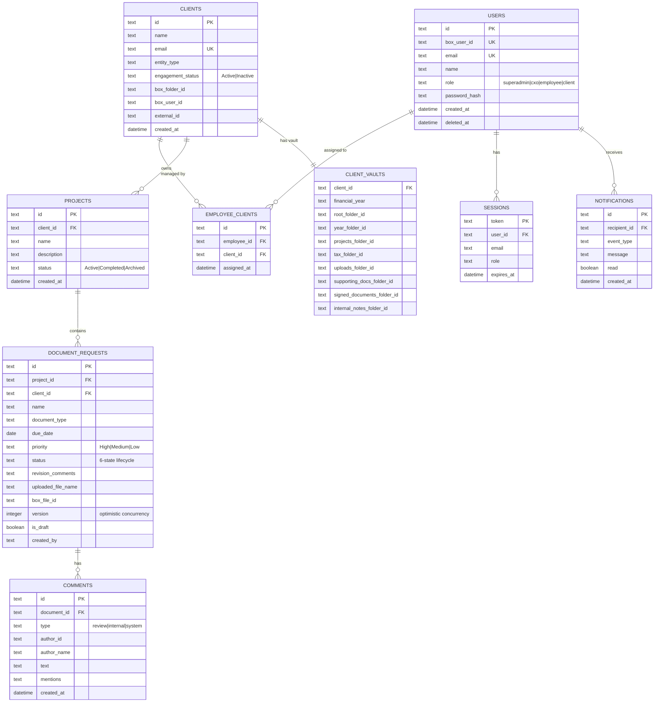
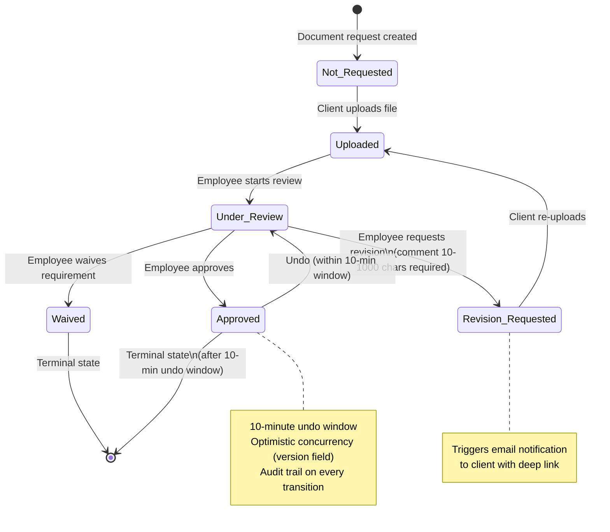
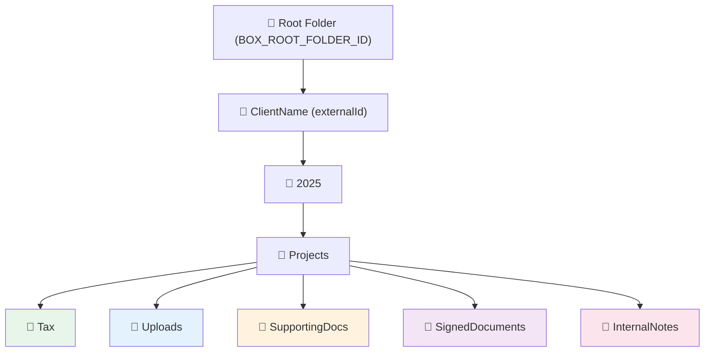
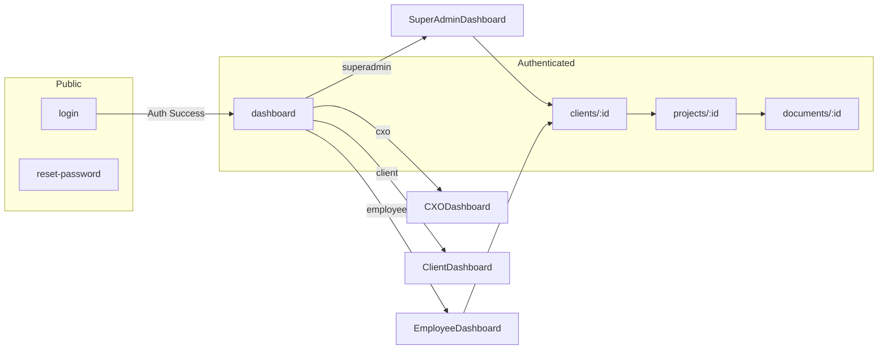

# TaxFlow Pro — System Architecture

## High-Level Overview

```mermaid
graph TB
    subgraph Frontend["taxflow-app (React + Vite, :5173)"]
        App[App.jsx]
        Auth[AuthContext]
        DWC[DocumentWorkflowContext]
        API[api.js Service Layer]
        
        subgraph Dashboards
            SA[SuperAdmin Dashboard]
            CXO[CXO Dashboard]
            EMP[Employee Dashboard]
            CLI[Client Dashboard]
        end
        
        subgraph Views
            CDV[ClientDetailView]
            PDV[ProjectDetailView]
            DDV[DocumentDetailView]
        end
        
        subgraph Components
            Review[ReviewMode + ApprovalActions]
            Upload[UploadDropzone + ClientUploadView]
            Comments[CommentsThread]
            DocReq[DocumentRequestCreator]
            AICard[AIExtractionCard]
        end
    end

    subgraph Backend["taxflow-api (Express, :3001)"]
        subgraph Routes
            AuthR["auth routes"]
            ProjR["project routes"]
            DocR["document routes"]
            RevR["review routes"]
            PortR["portal routes"]
            OnbR["onboarding route"]
            WebhR["webhook route"]
            EmpR["employee routes"]
            SignR["sign routes"]
            CompR["compliance routes"]
            NotifR["notification routes"]
            TokenR["token routes"]
        end
        
        subgraph Services
            AuthS[AuthService]
            ProjS[ProjectService]
            OnbS[OnboardingService]
            WebhS[WebhookService]
            RevS[ReviewService]
            STS[StatusTransitionService]
            UploadS[UploadService]
            EmailS[EmailService]
            NotifS[NotificationService]
            SignS[SignService]
            CompS[ComplianceService]
            AIExtS[AIExtractionService]
            BoxSvc[BoxService]
            CommentS[CommentService]
            PortalS[PortalService]
            TokenS[TokenService]
            DocTypeS[DocumentTypeService]
        end
        
        subgraph Infrastructure
            DB[("SQLite or PostgreSQL")]
            Cache[CacheLayer]
            CB[CircuitBreaker]
            RL[RateLimiter]
            Audit[AuditEngine]
            Logger[Logger]
        end
    end

    subgraph BoxWrapper["box-wrapper-service (TypeScript Library)"]
        JWT[JWTAuthModule]
        Schema[SchemaSyncEngine]
        BWS[BoxWrapperService]
    end

    subgraph External["External Services"]
        BoxAPI[Box Platform API]
        SMTP[SMTP Server]
    end

    %% Frontend → Backend
    API -->|"REST + Bearer Token"| Routes

    %% Backend internal wiring
    Routes --> Services
    Services --> DB
    BoxSvc --> BWS
    
    %% Box Wrapper → Box API
    JWT -->|JWT Auth| BoxAPI
    BWS --> JWT
    BWS --> Schema
    Schema -->|Metadata Templates| BoxAPI
    BWS -->|Folders, Files, Metadata| BoxAPI
    
    %% Backend → External
    EmailS -->|SMTP| SMTP
    WebhS -->|Register/Verify| BoxAPI
    BoxAPI -->|Webhook Events| WebhR
    OnbS --> BoxSvc
    UploadS --> BoxSvc
    SignS -->|Box Sign| BoxAPI
```



## Data Model (Entity Relationships)



## Document Workflow State Machine



## Client Onboarding Flow

```mermaid
sequenceDiagram
    participant E as Employee (Frontend)
    participant API as taxflow-api
    participant Box as Box Platform API
    participant SMTP as Email Server

    E->>API: POST /api/onboarding
    
    Note over API: Phase 1: Create App User
    API->>Box: Create platform-access-only user
    Box-->>API: userId, login
    
    Note over API: Phase 2: Folder Hierarchy
    API->>Box: Create root folder: "ClientName (externalId)"
    API->>Box: Create year folder (e.g., "2025")
    API->>Box: Create "Projects" folder
    API->>Box: Create subfolders: Tax, Uploads, SupportingDocs, SignedDocuments, InternalNotes
    Box-->>API: folder IDs
    
    Note over API: Phase 3: Folder Locks (enterprise only)
    API->>Box: Lock root, SignedDocuments, InternalNotes
    
    Note over API: Phase 4: Collaborations
    API->>Box: Client gets Uploads (viewer_uploader)
    API->>Box: Client gets Tax (viewer)
    API->>Box: Client gets SignedDocuments (viewer)
    API->>Box: Employee gets root (editor)
    
    Note over API: Phase 5: Webhook
    API->>Box: Register webhook on root folder
    Box-->>API: webhookId + signature keys
    
    Note over API: Phase 6: File Request
    API->>Box: Copy file request template to Uploads folder
    Box-->>API: file request URL
    
    API-->>E: Complete onboarding result
    API->>SMTP: Welcome email to client
```

## Authentication Flow

```mermaid
sequenceDiagram
    participant U as User (Browser)
    participant FE as taxflow-app
    participant BE as taxflow-api
    participant DB as Database
    participant Box as Box API

    U->>FE: Enter email + password
    FE->>BE: POST /api/auth/login {email, password}
    
    alt DB user found
        BE->>DB: Find user by email
        DB-->>BE: user record
        BE->>BE: Verify password hash
    else Fallback to Box
        BE->>Box: Get all users (with external_app_user_id)
        Box-->>BE: user list
        BE->>BE: Match email in externalAppUserId field
        BE->>BE: Verify password from encoded field
        BE->>DB: Auto-sync user to local DB
    end
    
    BE->>DB: Create session (token, userId, expiresAt)
    BE-->>FE: {sessionToken, user, expiresAt, vault?}
    
    FE->>FE: Store in sessionStorage
    FE->>FE: Set Authorization header
    FE->>FE: Start inactivity timer (30 min)
    FE->>FE: Schedule token refresh (5 min before expiry)
    
    Note over FE: On 401 response
    FE->>FE: Dispatch 'auth-unauthorized' event
    FE->>FE: Auto-logout + clear session
```

## Box Folder Hierarchy (Per Client)



**Access Control Matrix:**

| Folder | Client Access | Employee Access |
|--------|--------------|-----------------|
| Root | — | Editor |
| Tax | Viewer | Editor (inherited) |
| Uploads | Viewer + Uploader | Editor (inherited) |
| SupportingDocs | — | Editor (inherited) |
| SignedDocuments | Viewer | Editor (inherited) |
| InternalNotes | **No Access** | Editor (inherited) |

## Frontend Routing & Role Access



| Role | Dashboard | Can Navigate to Detail Views? |
|------|-----------|------------------------------|
| superadmin | SuperAdminDashboard | ✅ Full routing |
| cxo | CXODashboard | ❌ Dashboard only |
| employee | EmployeeDashboard | ✅ Full routing |
| client | ClientDashboard | ❌ Dashboard only |

## Technology Stack

| Layer | Technology |
|-------|-----------|
| Frontend | React 18, Vite, Framer Motion, React Router |
| Backend | Express.js (ES modules), Node.js 18+ |
| Database | SQLite (dev) / PostgreSQL (prod) via Knex |
| Box Integration | box-node-sdk (JWT auth), TypeScript wrapper |
| Email | Nodemailer (SMTP) with retry |
| Testing | Vitest, fast-check (property-based) |
| Resilience | Circuit breaker, rate limiter, cache layer, retry with backoff |
