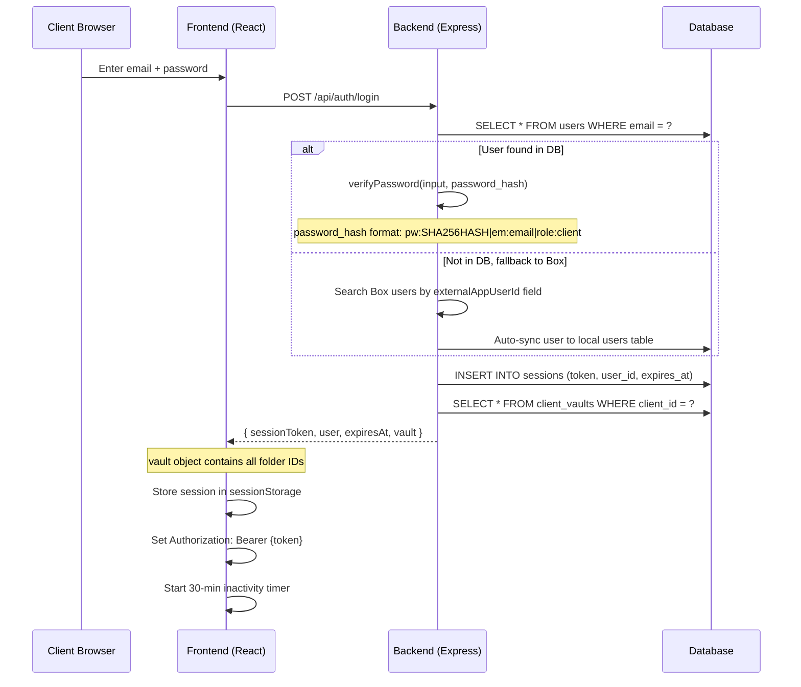
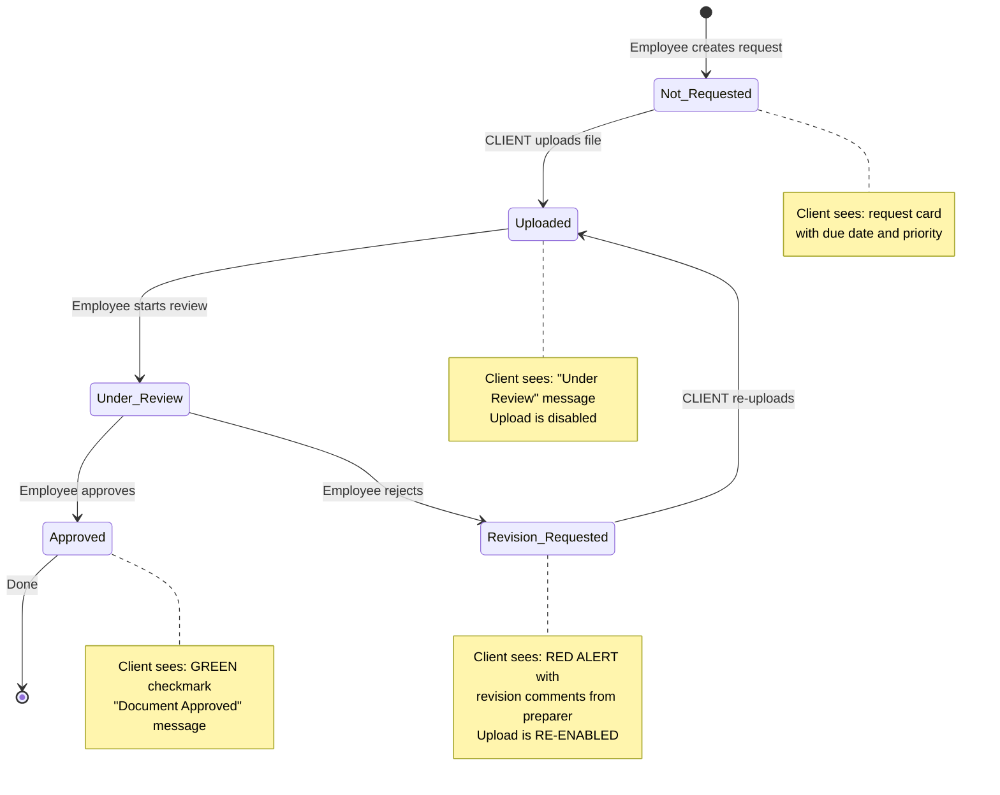

# TaxFlow Pro — Client Deep Dive

Everything a **client** touches, sees, and interacts with in the system.

---

## 1. Client Lifecycle Overview

```mermaid
sequenceDiagram
    participant Emp as Employee
    participant API as taxflow-api
    participant Box as Box Platform
    participant DB as Database
    participant Client as Client User

    Note over Emp,Client: PHASE 1 - ONBOARDING (Employee initiates)
    Emp->>API: POST /api/onboarding
    API->>Box: Create App User (platform-access-only)
    API->>Box: Create folder hierarchy
    API->>Box: Set collaborations
    API->>DB: Insert into clients, client_vaults, users
    API-->>Emp: Onboarding complete

    Note over Client: PHASE 2 - LOGIN
    Client->>API: POST /api/auth/login (email + password)
    API->>DB: Find user, verify password
    API->>DB: Load client_vaults row
    API-->>Client: sessionToken + user + vault folder IDs

    Note over Client: PHASE 3 - DASHBOARD
    Client->>API: GET /api/portal/client/:id/progress
    API->>DB: Query document_requests by client_id
    API-->>Client: documents + statusCounts

    Note over Client: PHASE 4 - UPLOAD
    Client->>API: POST /api/documents/upload (multipart)
    API->>Box: Upload file to Uploads folder
    API->>DB: Update document_request (status, file_id)
    API-->>Client: Upload success

    Note over Client: PHASE 5 - NOTIFICATIONS
    API->>Client: Email with deep-link (revision requested)
    Client->>API: Click deep-link, auto-login, view document
```

---

## 2. Client Data Model

### Database Tables Relevant to Client

```
┌─────────────────────────────────────────────────────────────┐
│ users                                                        │
├─────────────────────────────────────────────────────────────┤
│ id              TEXT PK                                       │
│ box_user_id     TEXT UNIQUE  ← Box App User ID               │
│ email           TEXT UNIQUE                                   │
│ name            TEXT                                          │
│ role            TEXT         ← "client"                       │
│ password_hash   TEXT         ← format: pw:{hash}|em:{email}|role:client │
│ created_at      DATETIME                                     │
└─────────────────────────────────────────────────────────────┘

┌─────────────────────────────────────────────────────────────┐
│ clients                                                      │
├─────────────────────────────────────────────────────────────┤
│ id                TEXT PK                                     │
│ name              TEXT                                        │
│ email             TEXT UNIQUE                                 │
│ entity_type       TEXT         ← "Individual", "LLC", etc.   │
│ engagement_status TEXT         ← "Active" | "Inactive"       │
│ box_folder_id     TEXT         ← Root vault folder ID        │
│ box_user_id       TEXT         ← Box App User ID             │
│ external_id       TEXT         ← Unique external identifier  │
│ created_at        DATETIME                                   │
└─────────────────────────────────────────────────────────────┘

┌─────────────────────────────────────────────────────────────┐
│ client_vaults                                                │
├─────────────────────────────────────────────────────────────┤
│ client_id              TEXT FK → clients.id                   │
│ financial_year         TEXT                                   │
│ root_folder_id         TEXT                                   │
│ year_folder_id         TEXT                                   │
│ projects_folder_id     TEXT                                   │
│ tax_folder_id          TEXT                                   │
│ uploads_folder_id      TEXT   ← WHERE CLIENT UPLOADS GO      │
│ supporting_docs_folder_id TEXT                                │
│ signed_documents_folder_id TEXT                               │
│ internal_notes_folder_id   TEXT ← CLIENT CANNOT SEE THIS     │
└─────────────────────────────────────────────────────────────┘

┌─────────────────────────────────────────────────────────────┐
│ document_requests                                            │
├─────────────────────────────────────────────────────────────┤
│ id                TEXT PK                                     │
│ project_id        TEXT FK → projects.id                       │
│ client_id         TEXT FK → clients.id                        │
│ name              TEXT         ← "W-2 from Employer"          │
│ document_type     TEXT         ← "W-2", "1099-INT", etc.     │
│ due_date          DATE                                        │
│ priority          TEXT         ← "High" | "Medium" | "Low"   │
│ status            TEXT         ← 6-state lifecycle            │
│ revision_comments TEXT         ← Why revision was requested   │
│ uploaded_file_name TEXT        ← Name of uploaded file        │
│ box_file_id       TEXT         ← Box file ID after upload     │
│ version           INTEGER      ← Optimistic concurrency       │
│ is_draft          BOOLEAN                                     │
│ created_by        TEXT                                        │
└─────────────────────────────────────────────────────────────┘
```

---

## 3. Client Authentication Flow



**What the client gets back on login:**
```json
{
  "sessionToken": "base64url-random-48-bytes",
  "user": {
    "id": "uuid",
    "email": "client@example.com",
    "name": "John Smith",
    "role": "client",
    "externalId": "ext-123"
  },
  "expiresAt": "2025-05-13T14:00:00.000Z",
  "vault": {
    "clientId": "uuid",
    "financialYear": "2025",
    "root": "box-folder-id-1",
    "year": "box-folder-id-2",
    "projects": "box-folder-id-3",
    "tax": "box-folder-id-4",
    "uploads": "box-folder-id-5",
    "supportingDocs": "box-folder-id-6",
    "signedDocuments": "box-folder-id-7",
    "internalNotes": "box-folder-id-8"
  }
}
```

---

## 4. Client Dashboard (What They See)

The client sees `ClientDashboard.jsx` which shows:

1. **Welcome message** with their name
2. **Preparer Requests** — list of documents the tax preparer needs from them
3. **Vault Browser** — browse files in their Box vault
4. **Document Requests** — clickable cards that open the upload view

**Data source:** `GET /api/portal/client/:clientId/progress`

Returns:
```json
{
  "clientId": "ext-123",
  "documents": [
    {
      "fileId": "box-file-id or doc-request-id",
      "name": "W-2 from Employer",
      "description": "Upload your W-2...",
      "documentType": "W-2",
      "status": "Not_Requested",
      "priority": "High",
      "dueDate": "2025-03-15",
      "reviewComments": null
    }
  ],
  "statusCounts": {
    "Not_Requested": 2,
    "Uploaded": 1,
    "Under_Review": 1,
    "Approved": 3,
    "Revision_Requested": 0
  }
}
```

---

## 5. Document Status Lifecycle (Client Perspective)



**What the client can DO at each status:**

| Status | Client Can Upload? | What Client Sees |
|--------|-------------------|------------------|
| Not_Requested | No (request just created) | Request card with due date |
| Pending (mapped from Not_Requested) | YES | Upload dropzone |
| Uploaded | No | "Under Review" with clock icon |
| Under_Review | No | "Under Review" with clock icon |
| Revision_Requested | YES | Red alert with comments + upload dropzone |
| Approved | No | Green checkmark animation |
| Waived | No | (not shown to client) |

---

## 6. Client Upload Flow

```mermaid
sequenceDiagram
    participant C as Client Browser
    participant FE as ClientUploadView
    participant API as taxflow-api
    participant Box as Box Platform
    participant DB as Database

    C->>FE: Drag file onto UploadDropzone
    FE->>FE: Validate file (type, size)
    FE->>API: POST /api/documents/upload (multipart/form-data)
    Note over FE,API: Body: file + folderId + requestId

    alt File < 50MB
        API->>Box: Standard upload to Uploads folder
    else File >= 50MB
        API->>Box: Chunked upload (8MB chunks, SHA-1 commit)
    end

    Box-->>API: { fileId, fileName, size, sha1 }
    API->>DB: UPDATE document_requests SET status='Uploaded', box_file_id=?, uploaded_file_name=?
    API-->>FE: { fileId, fileName, size }
    FE->>FE: dispatch({ type: 'UPLOAD_DOCUMENT', payload: { requestId, fileName } })
    FE->>FE: UI transitions to "Under Review" state
```

**Upload constraints:**
- Target folder: `vault.uploads` (from login response)
- Chunked threshold: 50MB
- Chunk size: 8MB
- Each chunk has SHA-1 integrity check
- Whole file SHA-1 verified at commit

---

## 7. Revision Flow (Client Gets Asked to Re-upload)

```mermaid
sequenceDiagram
    participant Emp as Employee
    participant API as taxflow-api
    participant DB as Database
    participant Email as SMTP
    participant C as Client

    Emp->>API: POST /api/documents/:id/transition (toStatus: Revision_Requested, comment: "...")
    API->>DB: UPDATE document_requests SET status='Revision_Requested', revision_comments='...'
    API->>API: Generate 7-day deep-link token (HMAC-SHA256)
    API->>Email: Send revision email with deep-link
    Email-->>C: "Action Required: Please re-upload document"

    Note over C: Client clicks email link
    C->>API: Deep-link resolves to document view
    C->>C: Sees RED revision alert with preparer comments
    C->>API: POST /api/documents/upload (re-upload)
    API->>Box: Upload new version
    API->>DB: UPDATE status='Uploaded', clear revision_comments
    API-->>C: Upload success
```

**Revision email contains:**
- Subject: "Action Required: Please re-upload {documentName}"
- Body: Preparer's revision comment
- Deep-link button: Signed JWT (7-day expiry, HMAC-SHA256)

---

## 8. Client Box Folder Access

```
Root Folder (BOX_ROOT_FOLDER_ID)
└── ClientName (externalId)          ← Client: NO direct access
    └── 2025                         ← Client: NO direct access
        └── Projects                 ← Client: NO direct access
            ├── Tax                  ← Client: VIEWER (read-only)
            ├── Uploads              ← Client: VIEWER + UPLOADER
            ├── SupportingDocs       ← Client: NO access
            ├── SignedDocuments       ← Client: VIEWER (read-only)
            └── InternalNotes        ← Client: NO ACCESS (hidden)
```

**Key insight:** The client can only:
- **Upload** to the `Uploads` folder
- **View** files in `Tax` and `SignedDocuments`
- **Never see** `InternalNotes` (employee-only)

---

## 9. Client Notifications

| Event | Channel | Trigger |
|-------|---------|---------|
| Revision Requested | Email + In-app | Employee rejects document |
| Document Approved | Email + In-app | Employee approves document |
| New Request Published | Email | Employee creates document request |
| Signature Requested | Email + In-app | Box Sign request created |

**Deep-link tokens:**
- Algorithm: HMAC-SHA256
- Secret: `DEEP_LINK_SECRET` env var
- Default expiry: 72 hours (revision emails: 7 days)
- Payload: `{ fileId, clientId, action, exp }`

---

## 10. Frontend State Management (Client Side)

The `DocumentWorkflowContext` manages client-side state:

```javascript
// State shape for each document request
{
  id: "doc-123",
  name: "W-2 from Employer",
  description: "Upload your W-2...",
  dueDate: "2025-03-15",
  priority: "High",
  status: "Not_Requested",       // 6-state enum
  revisionComments: null,         // Set when Revision_Requested
  uploadedFileName: null,         // Set after upload
  clientId: "ext-123",
  version: 1,                     // Increments on each state change
}
```

**Actions the client triggers:**
- `UPLOAD_DOCUMENT` — transitions Not_Requested/Revision_Requested to Uploaded
- `lookupVault(externalId)` — resolves vault folder IDs on login
- `initializeVault(...)` — creates vault if it doesn't exist (onboarding)

**Valid transitions from client actions:**
- `Not_Requested` → `Uploaded` (via upload)
- `Revision_Requested` → `Uploaded` (via re-upload)

All other transitions are employee-initiated.

---

## 11. API Endpoints the Client Uses

| Method | Endpoint | Purpose |
|--------|----------|---------|
| POST | /api/auth/login | Login with email + password |
| POST | /api/auth/logout | End session |
| POST | /api/auth/refresh | Extend session before expiry |
| POST | /api/auth/change-password | Change password |
| POST | /api/auth/forgot-password | Request reset email |
| POST | /api/auth/reset-password | Reset with token |
| GET | /api/portal/client/:id/progress | Dashboard data |
| GET | /api/clients/:externalId/vault | Get vault folder IDs |
| POST | /api/documents/upload | Upload file (multipart) |
| GET | /api/vaults/:folderId/files | Browse vault files |
| GET | /api/vaults/files/:fileId/download | Get download URL |
| GET | /api/notifications/:recipientId | Get notifications |

---

## 12. Post-Upload Pipeline (What Happens After Client Uploads)

When a file lands in Box (via webhook `FILE.UPLOADED`):

1. **Context extraction** — Walk folder hierarchy to find clientId and financialYear
2. **Metadata application** — Apply `taxflow_document` metadata template (status: "uploaded")
3. **AI extraction** — Fire-and-forget: extract structured data from document
4. **Review task creation** — Create Box task assigned to the employee
5. **Notification** — In-app notification to assigned employee

If this is a **re-upload** (revision flow):
1. Reset metadata status from "revision_requested" to "uploaded"
2. Clear review_comments
3. Create new review task for the original reviewer
4. Add "Re-uploaded by client" comment

---

## 13. Session Management (Client Side)

- **Session TTL:** 1 hour (server-side)
- **Inactivity timeout:** 30 minutes (client-side)
- **Warning at:** 25 minutes of inactivity
- **Auto-refresh:** 5 minutes before server expiry
- **Storage:** `sessionStorage` (cleared on tab close)
- **On 401:** Dispatches `auth-unauthorized` event → auto-logout
- **Activity tracking:** click, keydown, mousemove, touchstart events reset timer
